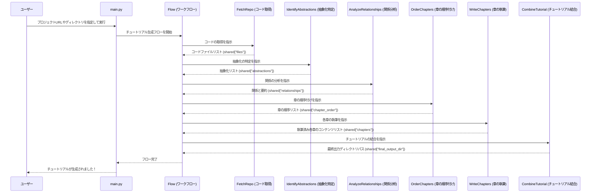

# Chapter 1: チュートリアル生成ワークフロー

## はじめに

ようこそ、`PocketFlow-Tutorial-Codebase-Knowledge-HITL` プロジェクトのチュートリアルへ！この章は、プロジェクト全体の最初の出発点であり、複雑なコードベースを初心者向けの分かりやすいチュートリアルに変えるための「中心的な頭脳」となる**チュートリアル生成ワークフロー**について学びます。

あなたがもし、巨大なコードベースを前にして、「一体どこから手をつ付ければいいんだろう？」「このプロジェクトは何をしているんだ？」と感じたことがあるなら、まさにそれがこのワークフローが解決しようとしている問題です。このプロジェクトの目標は、そんなコードの山から、重要な概念を抽出し、それらを論理的な順序で並べ、段階的に説明するチュートリアルを自動的に生成することです。

この章では、その目標を達成するために、どのようにプロジェクト全体が機能しているのか、その全体像をプロジェクトマネージャーのアナロジーを使って紐解いていきます。

## チュートリアル生成ワークフローとは？

チュートリアル生成ワークフローは、まるで熟練したプロジェクトマネージャーのようなものです。チュートリアルという最終的な成果物を完成させるために、コードの取得、概念の特定、章の執筆といった様々なタスクを、特定の専門家（この場合、`PocketFlow` の「ノード」）に特定の順序で割り当て、全体の進行を調整します。

このワークフローは、いくつかの段階を経て機能します。それぞれの段階は、独立した専門家（ノード）が担当し、前の段階からの情報を受け取り、次の段階へ情報を渡していきます。

主要なノードは以下の通りです。

1.  **コードの取得 (FetchRepo)**: GitHubリポジトリやローカルディレクトリからコードファイルを収集します。
2.  **抽象化の特定 (IdentifyAbstractions)**: コードの中から、プロジェクトの核となる重要な概念（抽象化）を見つけ出します。
3.  **関係の分析 (AnalyzeRelationships)**: 特定された抽象化同士がどのように関連し合っているかを分析します。
4.  **章の順序付け (OrderChapters)**: チュートリアルとして理解しやすいように、抽象化を説明する章の最適な順序を決定します。
5.  **章の執筆 (WriteChapters)**: 各抽象化に基づいたチュートリアル章のコンテンツを生成します。
6.  **チュートリアルの結合 (CombineTutorial)**: 生成されたすべての章をまとめ、最終的なチュートリアルファイル群として出力します。

## ワークフローの実行方法（ユースケース）

このチュートリアル生成ワークフローは、`main.py` スクリプトを通じて簡単に起動できます。例えば、あるGitHubリポジトリのチュートリアルを生成したい場合、以下のようにコマンドラインでリポジトリのURLを指定するだけです。

```bash
python main.py --repo https://github.com/ユーザー名/リポジトリ名 --language japanese --output output/my-repo-tutorial
```

このコマンドが実行されると、`main.py` は指定された情報をワークフローに渡し、チュートリアルの生成を開始します。

少しコードを見てみましょう。`main.py` は、コマンドライン引数を解析し、それらの情報を`shared`という辞書に格納します。そして、`create_tutorial_flow()` 関数を呼び出してワークフローを構築し、その`Flow`オブジェクトの`run()`メソッドに`shared`辞書を渡して実行を開始します。

```python
import argparse
from flow import create_tutorial_flow # フロー作成関数をインポート
import os
import dotenv

dotenv.load_dotenv() # .envファイルから環境変数を読み込む

def main():
    parser = argparse.ArgumentParser(description="GitHubコードベースまたはローカルディレクトリのチュートリアルを生成します。")
    parser.add_argument("--repo", help="公開GitHubリポジトリのURL。")
    parser.add_argument("--dir", help="ローカルディレクトリへのパス。")
    parser.add_argument("-o", "--output", default="output", help="出力のベースディレクトリ (デフォルト: ./output)。")
    parser.add_argument("--language", default="japanese", help="生成されるチュートリアルの言語 (デフォルト: japanese)")
    # ... 他の引数は省略 ...

    args = parser.parse_args()

    # 共有辞書を初期化し、入力データを格納します
    shared = {
        "repo_url": args.repo,
        "local_dir": args.dir,
        "project_name": args.name, # プロジェクト名 (省略可能)
        "github_token": args.token or os.environ.get('GITHUB_TOKEN'),
        "output_dir": args.output,
        "language": args.language, # チュートリアルの言語
        "use_cache": not args.no_cache, # LLMキャッシュの有効/無効
        "max_abstraction_num": args.max_abstractions, # 抽象化の最大数
        # ノードによって入力される出力フィールド
        "files": [], "abstractions": [], "relationships": {},
        "chapter_order": [], "chapters": [], "final_output_dir": None
    }

    print(f"チュートリアル生成を開始します: {args.repo or args.dir} ({args.language.capitalize()}言語)")

    # フローインスタンスを作成し、実行します
    tutorial_flow = create_tutorial_flow()
    tutorial_flow.run(shared) # shared辞書がノード間でデータを共有します

if __name__ == "__main__":
    main()
```

この`main.py`スクリプトは、ユーザーからの指示を受け取り、それらを`shared`という「情報共有ボード」に書き込みます。そして、その情報ボードを`tutorial_flow`というプロジェクトマネージャーに渡して、「さあ、仕事に取り掛かってください！」と指示するようなものです。

## 内部実装：ワークフローの構築

このプロジェクトマネージャー（`Flow`）がどのように構築されているか、`flow.py`ファイルの中を覗いてみましょう。

### ノードの接続

`flow.py`の中で定義されている`create_tutorial_flow()`関数は、前述の各専門家（ノード）をインスタンス化し、それらを正しい順序で接続することでワークフロー全体を構築します。

```python
from pocketflow import Flow # Flowはワークフローの核となるクラス
from nodes import ( # 各ノードクラスをインポート
    FetchRepo,
    IdentifyAbstractions,
    AnalyzeRelationships,
    OrderChapters,
    WriteChapters,
    CombineTutorial
)

def create_tutorial_flow():
    """コードベースチュートリアル生成フローを作成し返します。"""

    # ノードをインスタンス化します
    fetch_repo = FetchRepo()
    identify_abstractions = IdentifyAbstractions(max_retries=5, wait=20)
    analyze_relationships = AnalyzeRelationships(max_retries=5, wait=20)
    order_chapters = OrderChapters(max_retries=5, wait=20)
    write_chapters = WriteChapters(max_retries=5, wait=20) # BatchNode
    combine_tutorial = CombineTutorial()

    # 設計に基づいてノードを順次接続します
    fetch_repo >> identify_abstractions
    identify_abstractions >> analyze_relationships
    analyze_relationships >> order_chapters
    order_chapters >> write_chapters
    write_chapters >> combine_tutorial

    # FetchRepoを開始ノードとするフローを作成します
    tutorial_flow = Flow(start=fetch_repo)

    return tutorial_flow
```

ここで重要なのは、`>>` 演算子です。これは、「`fetch_repo`の次に`identify_abstractions`を実行する」というように、データの流れとタスクの実行順序を定義しています。ちょうど、料理のレシピで「野菜を切る >> 肉を炒める >> 煮込む」という手順を指示するようなものです。

### データの流れを視覚化

このワークフロー全体のデータの流れを、Mermaidのシーケンス図で見てみましょう。



この図が示すように、`main.py` がユーザーの入力を受け取って`Flow`を開始し、`Flow`が各ノードを順番に呼び出します。各ノードは、`shared`という共通の辞書を通じて、必要な情報を読み込んだり、処理結果を書き込んだりしています。これにより、ノード同士がスムーズに連携し、前のノードの出力が次のノードの入力として機能する、一連のパイプラインが形成されます。

## 次のステップ

この章では、チュートリアルを生成するための全体的なワークフローと、その主要な構成要素、そしてどのように実行されるかの全体像を理解しました。これは、複雑なプロセスを小さな管理可能なタスクに分解し、それぞれを専門のモジュール（ノード）に任せることで、柔軟で拡張性の高いシステムを構築する設計パターンです。

次章では、このワークフローの重要な要素である [LLMインタラクションとキャッシュ](02_llmインタラクションとキャッシュ_.md) について詳しく掘り下げます。ここでは、大規模言語モデル (LLM) を効果的に利用し、パフォーマンスを向上させるためのキャッシング戦略について学びます。

それでは、次の章でお会いしましょう！

---

**次章へのリンク:** [Chapter 2: LLMインタラクションとキャッシュ](02_llmインタラクションとキャッシュ_.md)

---

Generated by [AI Codebase Knowledge Builder](https://github.com/The-Pocket/Tutorial-Codebase-Knowledge)