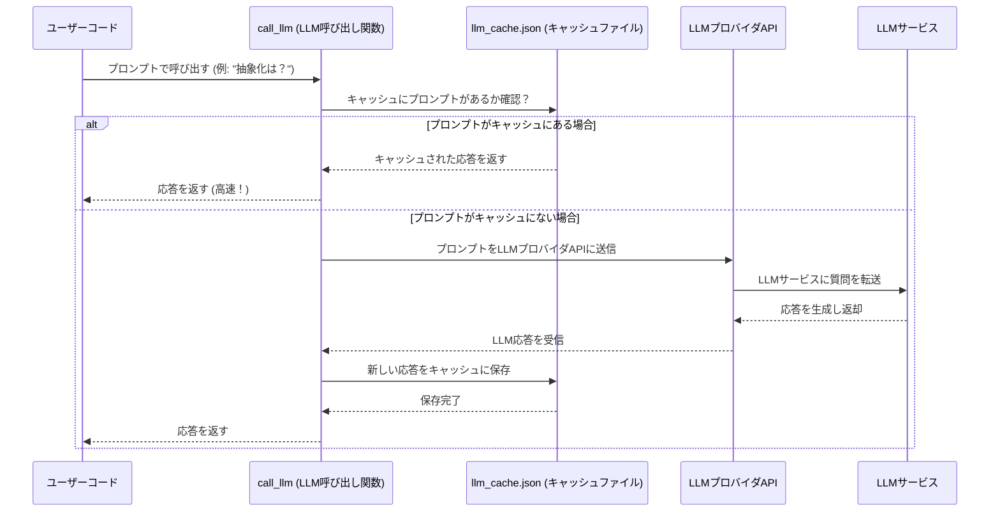

# Chapter 2: LLMインタラクションとキャッシュ

前章の[チュートリアル生成ワークフロー](01_チュートリアル生成ワークフロー_.md)では、`PocketFlow-Tutorial-Codebase-Knowledge-HITL` プロジェクトがどのようにして複雑なコードベースからチュートリアルを自動生成するのか、その全体像と各ステップ（ノード）の役割について学びました。まるでプロジェクトマネージャーが専門家たちにタスクを割り当てるように、情報が各ノード間を流れていく様子を理解できたことでしょう。

本章では、そのワークフローの中心的な「AI頭脳」とも言える**大規模言語モデル（LLM）との通信**に焦点を当てます。特に、どのようにLLMに指示を送り、その応答を受け取り、さらに賢く**以前の応答をキャッシュして処理を高速化し、コストを削減する**仕組みについて詳しく見ていきます。これは、まるで一般的な質問の答えを記憶していて、すぐに返答できる優秀なアシスタントのようなものです。

## LLMインタラクションとキャッシュとは？

このコンポーネントは、プロジェクトが外部のLLM（例えばGoogle GeminiやOllamaなど）とやり取りするためのすべての処理を管理します。具体的には、以下の二つの主要な役割があります。

1.  **LLMインタラクション（LLM Interaction）**: プロジェクトの目的（コードベースの抽象化特定、関係分析、章の執筆など）に応じて、適切な「プロンプト」（質問や指示）を作成し、LLMに送信します。そして、LLMが生成した「応答」（情報やテキスト）を受け取ります。
2.  **キャッシュ（Caching）**: 同じプロンプトが再度送信された場合、以前に受け取ったLLMの応答を一時的に保存しておき、LLMに再問い合わせすることなく、すぐに保存された応答を返す機能です。これにより、処理速度が大幅に向上し、LLMの使用にかかる費用も削減できます。

この仕組みは、まるであなたが**特定の質問の答えをメモ帳に書き留めておく**ようなものです。

*   初めての質問には、時間と労力をかけて図書館（LLM）に行って答えを探します。見つけたら、メモ帳に書き留めます。
*   次に同じ質問をされたら、メモ帳（キャッシュ）を見るだけで、すぐに答えを教えることができます。図書館に行く手間が省けるので、速くて、余計なコストもかかりません。

`PocketFlow` プロジェクトでは、この「メモ帳」の役割を果たすのが`llm_cache.json`ファイルです。

## なぜLLMインタラクションとキャッシュが必要なのか？

私たちのプロジェクトは、コードベースの分析からチュートリアルの生成まで、非常に多くの場面でLLMの高度な推論能力に依存しています。もし、すべてのLLMリクエストを毎回ゼロから実行していたら、次のような問題が発生します。

*   **遅い**: LLMの応答には時間がかかります。特に複雑なプロンプトでは数秒から数十秒かかることもあり、これが何度も繰り返されると、全体のワークフローが非常に遅くなります。
*   **費用がかかる**: ほとんどの商用LLMサービスは、使用量（トークン数）に応じて課金されます。同じ質問を何度も繰り返せば、それだけ費用もかさんでしまいます。
*   **冗長な処理**: コードベースの分析中に同じコードスニペットについて何度もLLMに尋ねる必要が生じる場合があります。キャッシュがなければ、無駄な再計算が発生します。

キャッシュはこれらの問題を解決し、チュートリアル生成プロセスを**効率的**かつ**費用対効果の高い**ものにするために不可欠なのです。

## `call_llm`関数の使い方

プロジェクト内の他のノード（例えば、抽象化を特定する`IdentifyAbstractions`や章を執筆する`WriteChapters`など）は、LLMと対話する必要がある際に、`utils/call_llm.py`モジュール内の`call_llm`関数を使用します。

この関数は非常にシンプルで、LLMへの「プロンプト」（指示や質問）を文字列として受け取り、LLMが生成した「応答」を文字列として返します。

例えば、あるノードがコードベースの抽象化を特定するためにLLMを呼び出す場合、次のように使われます。

```python
from utils.call_llm import call_llm

def identify_abstraction_with_llm(code_context: str):
    prompt = f"""
    以下のコードベースの文脈から、最も重要な抽象化を特定してください。
    コードの文脈:
    {code_context}

    抽象化のリストをYAML形式で出力してください。
    """
    # LLMにプロンプトを送信し、応答を受け取ります
    response = call_llm(prompt, use_cache=True) # キャッシュを使用することを指定
    return response

# 例：ダミーのコードコンテキスト
dummy_code = "def process_data(data): return data * 2"
llm_output = identify_abstraction_with_llm(dummy_code)
print(llm_output)
```

上記のコードスニペットでは、`call_llm`関数に`prompt`（プロンプト）と`use_cache=True`（キャッシュを使用する）という引数を渡しています。`use_cache`が`True`の場合、`call_llm`はまずキャッシュをチェックし、存在すればそれを利用します。

## 内部実装：LLM呼び出しの裏側

では、`call_llm`関数がどのようにキャッシュを管理し、実際のLLMと通信しているのか、`utils/call_llm.py`ファイルの中を覗いてみましょう。

### 処理のシーケンス

`call_llm`関数が呼び出されたときの処理の流れは、次のようになります。

1.  **呼び出し**: ユーザーコード（または他のノード）が特定のプロンプトとともに`call_llm`を呼び出します。
2.  **キャッシュの確認**: `call_llm`は、まず`llm_cache.json`ファイルに、このプロンプトに対する以前の応答が保存されているかを確認します。
3.  **キャッシュヒット**: もしプロンプトがキャッシュファイルに見つかった場合、`call_llm`は実際のLLMに問い合わせることなく、すぐにキャッシュされた応答を返します。
4.  **キャッシュミス**: プロンプトがキャッシュに見つからない場合、`call_llm`は環境変数（`LLM_PROVIDER`など）に基づいて適切なLLMプロバイダ（Gemini、Ollamaなど）を選択し、実際のLLM APIを呼び出します。
5.  **応答の受信と保存**: LLMプロバイダから応答を受け取ると、`call_llm`はその応答を`llm_cache.json`ファイルに新しいエントリとして保存します。
6.  **応答の返却**: 最後に、`call_llm`は受け取った（またはキャッシュから取得した）応答を呼び出し元に返します。

この流れをMermaidシーケンス図で視覚化すると、次のようになります。



### コードスニペットの解説

`utils/call_llm.py`から主要な部分を見てみましょう。

#### キャッシュのロードと保存

`load_cache()`と`save_cache()`関数は、JSONファイル（`llm_cache.json`）を使って、プロンプトとその応答のペアをディスクに保存・読み込みます。これにより、プログラムが終了してもキャッシュされたデータが失われず、次回実行時に再利用できます。

```python
import json
import os
# ... (他のインポートは省略) ...

cache_file = "llm_cache.json"

def load_cache():
    try:
        with open(cache_file, 'r', encoding='utf-8') as f:
            return json.load(f)
    except FileNotFoundError: # ファイルがない場合は空のキャッシュを返す
        return {}
    except json.JSONDecodeError: # JSONが壊れている場合も空のキャッシュを返す
        return {}
    except Exception as e:
        logger.warning(f"Failed to load cache: {e}")
    return {}


def save_cache(cache):
    try:
        with open(cache_file, 'w', encoding='utf-8') as f:
            json.dump(cache, f, ensure_ascii=False, indent=4) # 見やすくするためにインデントを設定
    except Exception as e:
        logger.warning(f"Failed to save cache: {e}")
```

これらの関数は、キャッシュの永続性を確保し、LLMへの不必要な呼び出しを避ける上で非常に重要です。

#### `call_llm`関数

これがLLMとのインタラクションとキャッシュロジックの中心となる関数です。

```python
def call_llm(prompt: str, use_cache: bool = True) -> str:
    # プロンプトをログに記録
    logger.info(f"PROMPT: {prompt}")

    # キャッシュが有効な場合、まずキャッシュをチェック
    if use_cache:
        cache = load_cache() # キャッシュをロード
        if prompt in cache: # プロンプトがキャッシュにあるか確認
            logger.info(f"RESPONSE (from cache): {cache[prompt]}")
            return cache[prompt] # キャッシュされた応答を返す

    # キャッシュにない場合、LLMプロバイダを特定
    provider = get_llm_provider()
    if provider == "GEMINI":
        response_text = _call_llm_gemini(prompt) # Geminiを呼び出す
    else:  # それ以外の汎用API互換プロバイダを呼び出す
        response_text = _call_llm_provider(prompt)

    # LLMからの応答をログに記録
    logger.info(f"RESPONSE (from LLM): {response_text}")

    # キャッシュが有効な場合、新しい応答をキャッシュに保存
    if use_cache:
        # 他のプロセスが同時にキャッシュを更新する可能性を考慮し、再度ロードしてから保存
        cache = load_cache()
        cache[prompt] = response_text
        save_cache(cache)

    return response_text
```

*   `use_cache: bool = True`という引数は、キャッシュを使うかどうかを制御します。これにより、特定の状況でキャッシュを無効にすることも可能です（例えば、LLMの動作をデバッグしたい場合など）。
*   `if prompt in cache:` の行が、プロンプトがキャッシュに存在するかどうかを確認する部分です。
*   `get_llm_provider()`は環境変数からどのLLMサービスを使用するかを決定します。
*   `_call_llm_gemini(prompt)`や`_call_llm_provider(prompt)`は、それぞれのLLMサービス（Google GeminiやOllamaなど）の実際のAPIエンドポイントと通信するための内部関数です。これらの詳細はこの章では深入りしませんが、「外部のAIサービスと話すための電話回線」のようなものだと考えてください。

### ノードでの利用例

前章で紹介した`IdentifyAbstractions`ノードの`exec`メソッドでは、この`call_llm`関数がどのように使われているかを見ることができます。

```python
class IdentifyAbstractions(Node):
    # ... (省略) ...
    def exec(self, prep_res):
        (
            context,
            file_listing_for_prompt,
            file_count,
            project_name,
            language,
            use_cache, # prepで取得したuse_cacheフラグ
            max_abstraction_num,
        ) = prep_res
        print(f"Identifying abstractions using LLM...")

        prompt = f"""
        プロジェクト`{project_name}`について、以下のコードベースの文脈を分析し、
        主要な抽象化を特定してください。
        ... (プロンプトの残りの部分) ...
        """
        # ここでLLMを呼び出す。現在のリトライ回数が0の場合のみキャッシュを使用
        # リトライ時は最新のLLM応答を取得するため、キャッシュを無効にするのが一般的
        response = call_llm(prompt, use_cache=(use_cache and self.cur_retry == 0))
        # ... (応答の検証と処理) ...
        return validated_abstractions
```

このように、`IdentifyAbstractions`ノードは、`prep`メソッドで`shared`辞書から受け取った`use_cache`フラグと現在のリトライ回数に基づいて、賢く`call_llm`関数を呼び出しています。初回呼び出しではキャッシュを利用し、エラーが発生してリトライする際には、新しい応答を得るためにキャッシュを無効にする、という巧妙な戦略が取られています。

## まとめ

本章では、`PocketFlow`プロジェクトの「AI頭脳」であるLLMとのインタラクションと、それを効率化するためのキャッシュシステムについて深く掘り下げました。

*   `call_llm`関数が、LLMへのプロンプト送信と応答受信のハブであることを学びました。
*   `llm_cache.json`ファイルを使ったキャッシュが、LLMへの不必要な問い合わせを削減し、処理の高速化とコスト削減に貢献していることを理解しました。
*   この仕組みは、まるで質問の答えを記憶しているアシスタントのように、プロジェクト全体の効率性を高めているのです。

この「AIの頭脳」を理解したところで、次章では、このLLMが分析するための「生の情報」をどこから取得するのか、つまり[コードベースクローラー](03_コードベースクローラー_.md)について詳しく見ていきましょう。

---

**次章へのリンク:** [Chapter 3: コードベースクローラー](03_コードベースクローラー_.md)

---

Generated by [AI Codebase Knowledge Builder](https://github.com/The-Pocket/Tutorial-Codebase-Knowledge)