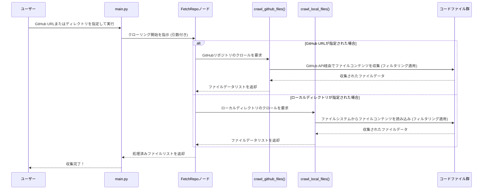

# Chapter 3: コードベースクローラー

前章の[LLMインタラクションとキャッシュ](02_llmインタラクションとキャッシュ_.md)では、大規模言語モデル（LLM）と効率的に対話するためのキャッシュシステムについて学びました。LLMが私たちのプロジェクトの「AI頭脳」であるとすれば、そのLLMが分析するための「生の情報」はどこから来るのでしょうか？それが本章のテーマ、**コードベースクローラー**の役割です。

## コードベースクローラーとは？

コードベースクローラーは、`PocketFlow-Tutorial-Codebase-Knowledge-HITL`プロジェクトにおいて、GitHubリポジトリやローカルディレクトリから実際のコードファイルを収集する役割を担う抽象化です。

まるで、**指定された基準に基づいて関連するすべての書籍（コードファイル）を集め、分析に役立つ資料のみが収集されるようにする勤勉な司書**のようなものです。この「司書」は、膨大なコードの海から、特定の条件（含めるべきファイルの種類、除外すべきディレクトリ、最大ファイルサイズなど）に合致するファイルだけを賢く選び出します。

なぜこのような「クローラー」が必要なのでしょうか？

*   **関連性の高い情報の取得**: コードベース全体をLLMに渡すのは非効率的で、コストもかかります。本当に重要なファイルだけを抽出することで、LLMの分析を効率化し、より質の高いチュートリアル生成を促します。
*   **リポジトリのタイプを問わない収集**: GitHubのようなリモートリポジトリだけでなく、手元のローカルディレクトリにあるコードも対象にできるため、柔軟な利用が可能です。
*   **ファイルサイズの管理**: 極端に大きなファイル（例えばバイナリファイルや巨大なログファイル）を除外することで、処理負荷を軽減し、LLMのコンテキストウィンドウの制限を回避します。

このステップは、チュートリアル生成ワークフローの最初の、そして最も重要な「データ収集」フェーズを構成します。

## コードベースクローラーの仕組み

`PocketFlow`プロジェクトでは、[チュートリアル生成ワークフロー](01_チュートリアル生成ワークフロー_.md)で紹介した`FetchRepo`ノードが、このコードベースクローラーの役割を担っています。`FetchRepo`ノードは、ユーザーが指定したソース（GitHubリポジトリURLまたはローカルディレクトリパス）に応じて、適切なクローリング処理を実行します。

主な機能は以下の通りです。

1.  **ソースの識別**: 入力としてGitHubリポジトリのURLが与えられたか、それともローカルディレクトリのパスが与えられたかを判断します。
2.  **ファイルの収集**:
    *   **GitHubの場合**: GitHub APIを使用してリポジトリのファイル構造を探索し、各ファイルのコンテンツを取得します。
    *   **ローカルの場合**: ファイルシステムを探索し、各ファイルのコンテンツを読み取ります。
3.  **フィルタリング**:
    *   **含めるパターン (`include_patterns`)**: 特定の拡張子（例: `.py`, `.js`, `.md`）や名前パターンに一致するファイルのみを対象とします。
    *   **除外パターン (`exclude_patterns`)**: テストファイル（例: `test_*`）や設定ファイル（例: `.gitignore`）、特定のディレクトリ（例: `node_modules/`）など、分析対象から外したいファイルを指定します。ローカルディレクトリの場合、`.gitignore`ファイルの内容も自動的に考慮されます。
    *   **最大ファイルサイズ (`max_file_size`)**: サイズが大きすぎるファイルをスキップし、LLMの処理に適したサイズのファイルのみを収集します。

### `FetchRepo`ノードの動作

`FetchRepo`ノードがどのようにこのクローリングを実行するか、その中心的な部分を見てみましょう。

```python
# nodes.py からの抜粋
class FetchRepo(Node):
    # ... (前処理部分は省略) ...

    def exec(self, prep_res):
        if prep_res["repo_url"]:
            print(f"Crawling repository: {prep_res['repo_url']}...")
            result = crawl_github_files( # GitHubリポジトリをクロールする関数を呼び出し
                repo_url=prep_res["repo_url"],
                token=prep_res["token"],
                include_patterns=prep_res["include_patterns"],
                exclude_patterns=prep_res["exclude_patterns"],
                max_file_size=prep_res["max_file_size"],
                use_relative_paths=prep_res["use_relative_paths"],
            )
        else:
            print(f"Crawling directory: {prep_res['local_dir']}...")
            result = crawl_local_files( # ローカルディレクトリをクロールする関数を呼び出し
                directory=prep_res["local_dir"],
                include_patterns=prep_res["include_patterns"],
                exclude_patterns=prep_res["exclude_patterns"],
                max_file_size=prep_res["max_file_size"],
                use_relative_paths=prep_res["use_relative_paths"]
            )

        # 収集されたファイルをリスト形式に変換: [(パス, コンテンツ), ...]
        files_list = list(result.get("files", {}).items())
        if len(files_list) == 0:
            raise (ValueError("ファイルの取得に失敗しました"))
        print(f"{len(files_list)}個のファイルを取得しました。")
        return files_list

    def post(self, shared, prep_res, exec_res):
        shared["files"] = exec_res # 収集されたファイルを共有データに保存
```

このコードは、`repo_url`が存在するかどうかによって、`crawl_github_files`関数と`crawl_local_files`関数のどちらを呼び出すかを切り替えていることがわかります。これらの関数は、それぞれGitHubとローカルファイルシステムに特化したクローリングロジックを実装しています。

### クローリング処理のシーケンス

コードベースクローラーがどのように機能するかのシーケンスを、簡単なMermaid図で見てみましょう。



この図は、ユーザーの入力に応じて`FetchRepo`ノードが適切なクローラー関数を呼び出し、フィルタリングされたコードファイルデータが返されるまでの流れを示しています。

## 内部実装：ファイル収集とフィルタリング

では、実際にファイル収集とフィルタリングを行っている`crawl_github_files`と`crawl_local_files`関数の内部を少し詳しく見てみましょう。これらの関数は、それぞれ`utils/crawl_github_files.py`と`utils/crawl_local_files.py`に定義されています。

### GitHubからのファイル収集 (`crawl_github_files`)

`crawl_github_files`はGitHub APIを利用して、リポジトリ内のファイルを探索し、コンテンツを取得します。

```python
# utils/crawl_github_files.py からの抜粋 (簡略化)
import requests
import fnmatch # ファイル名パターンマッチング用
# ... (他のインポートは省略) ...

def crawl_github_files(repo_url, token=None, max_file_size=1048576, # 1MB
                       include_patterns=None, exclude_patterns=None):
    # パターンをセット形式に変換（もし単一の文字列であれば）
    if include_patterns and isinstance(include_patterns, str):
        include_patterns = {include_patterns}
    if exclude_patterns and isinstance(exclude_patterns, str):
        exclude_patterns = {exclude_patterns}

    def should_include_file(file_path: str, file_name: str) -> bool:
        # includeパターンによるチェック: いずれかのパターンに一致するか？
        if include_patterns:
            if not any(fnmatch.fnmatch(file_name, pattern) for pattern in include_patterns):
                return False
        # excludeパターンによるチェック: いずれかのパターンに一致しないか？
        if exclude_patterns:
            if any(fnmatch.fnmatch(file_path, pattern) for pattern in exclude_patterns):
                return False
        return True # すべてのチェックを通過した場合

    files = {} # 収集されたファイルを格納する辞書
    skipped_files = [] # スキップされたファイルを記録

    # GitHub APIを呼び出すロジック (URL解析、APIリクエストなど、ここでは省略)
    # ... (実際のGitHub APIへのHTTPリクエスト処理は複雑なため省略します) ...

    # 例えば、GitHub APIから取得したコンテンツリストを処理する部分:
    # for item in contents: # API応答の各アイテム（ファイルまたはディレクトリ）
    #     item_path = item["path"]
    #     if item["type"] == "file":
    #         # フィルタリング
    #         if not should_include_file(item_path, item["name"]):
    #             print(f"Skipping {item_path}: パターンに一致しない")
    #             continue
    #         file_size = item.get("size", 0)
    #         if file_size > max_file_size:
    #             print(f"Skipping {item_path}: サイズが上限を超える")
    #             skipped_files.append((item_path, file_size))
    #             continue
    #         
    #         # ファイルコンテンツのダウンロード処理 (APIコールまたはダウンロードURL経由、省略)
    #         # ... (ファイルコンテンツの取得とデコードは省略します) ...
    #         files[item_path] = file_content
    #         print(f"Downloaded: {item_path}")
    #     elif item["type"] == "dir":
    #         # ディレクトリは再帰的に探索（ここでは省略）
    #         fetch_contents(item_path) # 再帰呼び出し

    # 例として、ダミーデータを返す
    files["example.py"] = "def hello_world(): print('Hello')"
    files["README.md"] = "# チュートリアル"

    return {"files": files, "stats": {"downloaded_count": len(files), "skipped_count": 0}}
```

この関数は、`requests`ライブラリを使ってGitHub APIと通信し、`fnmatch`モジュールを使ってファイル名パターン（ワイルドカード`*`など）を効率的に照合します。ファイルのサイズチェックもここで行われます。

### ローカルディレクトリからのファイル収集 (`crawl_local_files`)

ローカルファイルシステムからの収集は、GitHub APIへの依存がなく、`os.walk`関数を使ってディレクトリツリーを辿ります。特に重要なのは、`.gitignore`ファイルの考慮です。

```python
# utils/crawl_local_files.py からの抜粋 (簡略化)
import os
import fnmatch
import pathspec # .gitignoreファイル解析用
# ... (他のインポートは省略) ...

def crawl_local_files(directory, include_patterns=None, exclude_patterns=None,
                      max_file_size=None, use_relative_paths=True):
    # .gitignoreファイルをロード
    gitignore_spec = None
    gitignore_path = os.path.join(directory, ".gitignore")
    if os.path.exists(gitignore_path):
        with open(gitignore_path, "r", encoding="utf-8-sig") as f:
            gitignore_patterns = f.readlines()
        gitignore_spec = pathspec.PathSpec.from_lines("gitwildmatch", gitignore_patterns)
        print(f".gitignoreのパターンを{gitignore_path}からロードしました")

    files_dict = {}
    all_files = []

    # os.walkでディレクトリツリーを探索
    for root, dirs, files in os.walk(directory):
        # .gitignoreとexcludeパターンに基づいてディレクトリを早期にフィルタリング（ここでは詳細は省略）
        # ... (ディレクトリフィルタリングのロジックは省略) ...
        for filename in files:
            filepath = os.path.join(root, filename)
            all_files.append(filepath)

    for filepath in all_files:
        relpath = os.path.relpath(filepath, directory) if use_relative_paths else filepath

        # --- 除外チェック (.gitignoreとexclude_patterns) ---
        excluded = False
        if gitignore_spec and gitignore_spec.match_file(relpath):
            excluded = True
        if not excluded and exclude_patterns:
            for pattern in exclude_patterns:
                if fnmatch.fnmatch(relpath, pattern):
                    excluded = True
                    break
        if excluded:
            continue # このファイルはスキップ

        # --- 含めるチェック (include_patterns) ---
        included = False
        if include_patterns:
            for pattern in include_patterns:
                if fnmatch.fnmatch(relpath, pattern):
                    included = True
                    break
        else: # includeパターンが指定されていなければ、全て含む
            included = True
        if not included:
            continue # このファイルはスキップ

        # --- ファイルサイズチェック ---
        if max_file_size and os.path.getsize(filepath) > max_file_size:
            continue # サイズが大きすぎるファイルはスキップ

        # ファイルコンテンツを読み込み
        try:
            with open(filepath, "r", encoding="utf-8-sig") as f:
                content = f.read()
            files_dict[relpath] = content
        except Exception as e:
            print(f"Warning: ファイル{filepath}の読み込みに失敗しました: {e}")
            # エラー発生したファイルはスキップ
            continue

    return {"files": files_dict}
```

この`crawl_local_files`関数は、`os.walk`を使って効率的にディレクトリを探索し、`pathspec`ライブラリを使って`.gitignore`ルールを適用します。これにより、Gitで管理されているプロジェクトでは、自動的に不必要なファイル（ビルド成果物、一時ファイルなど）が収集対象から除外され、非常に便利です。

このように、コードベースクローラーは、指定された条件に基づいて必要なコードファイルを効率的に収集し、次のステップである [抽象化特定](04_抽象化特定_.md) へと渡す準備をします。

## まとめ

本章では、`PocketFlow`プロジェクトがどのようにしてコードベースの生データを収集するのか、その最初のステップである**コードベースクローラー**について学びました。

*   `FetchRepo`ノードが、GitHubリポジトリまたはローカルディレクトリからコードファイルを収集する役割を担っていることを理解しました。
*   このクローラーが、含める/除外パターンや最大ファイルサイズといった基準に基づいてファイルをインテリジェントにフィルタリングし、LLMによる分析に最適なデータセットを準備することを学びました。
*   まるで勤勉な司書のように、必要な情報だけを選び出すことで、チュートリアル生成プロセスの効率と精度が向上するのです。

コードという「図書館」から関連性の高い「書籍」を集める方法を理解したところで、次章では、集められたコードの中からプロジェクトの核となる重要な概念、つまり**抽象化**をどのように見つけ出すのか、[抽象化特定](04_抽象化特定_.md)について詳しく見ていきましょう。

---

**次章へのリンク:** [Chapter 4: 抽象化特定](04_抽象化特定_.md)

---

Generated by [AI Codebase Knowledge Builder](https://github.com/The-Pocket/Tutorial-Codebase-Knowledge)