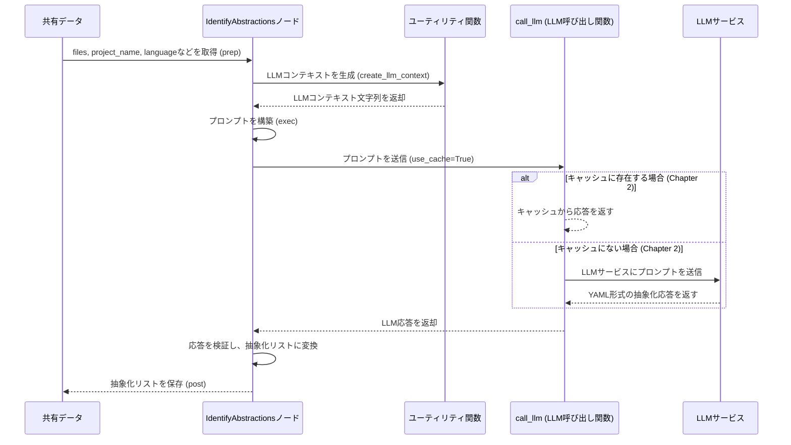

# Chapter 4: 抽象化特定

前章の[コードベースクローラー](03_コードベースクローラー_.md)では、`PocketFlow-Tutorial-Codebase-Knowledge-HITL` プロジェクトが、指定されたGitHubリポジトリやローカルディレクトリから、チュートリアル生成に必要なコードファイルをどのように効率的に収集するのかを学びました。まるで、広大な図書館から必要な書籍だけを選び出す勤勉な司書のような役割でしたね。

しかし、収集されたコードファイルはまだ「生のデータ」の山です。この膨大な情報から、プロジェクトの核となる重要な概念や仕組みを、初心者が理解できるように抽出するにはどうすれば良いでしょうか？本章では、その「生のコードの山」を意味のある「主要な構成要素」へと変換する、重要なステップである**抽象化特定**について深く掘り下げていきます。

## 抽象化特定とは？

抽象化特定とは、LLM（大規模言語モデル）の力を借りて、収集されたコードベースの中から最も重要で、プロジェクトの中心となる概念や機能を洗い出すプロセスです。これは、まるで**複雑な機械の設計図を前にした熟練のエンジニアが、初心者に説明するために「エンジン」「ブレーキシステム」「操縦系」といった主要なシステムだけを素早く見つけ出し、強調表示する**ようなものです。

なぜこのステップがそれほど重要なのでしょうか？

*   **複雑性の管理**: どんな大規模なコードベースも、最初は圧倒されるほど複雑に見えます。抽象化を特定することで、この複雑性を管理しやすい、より小さな論理的ブロックに分解できます。
*   **学習の出発点**: 初心者がコードベースを理解する上で、どこから手をつければ良いのか、何が最も重要なのかを示す明確なガイドラインを提供します。
*   **チュートリアルの骨格**: チュートリアルの各章は、これらの特定された抽象化に基づいて作成されます。つまり、このステップはチュートリアルの内容と構造の基礎を築きます。
*   **LLMの効率的な利用**: LLMがコードベース全体を細かく分析するのではなく、主要な概念を抽出することに集中させることで、より的確で質の高い分析結果を得られます。

このプロセスを通じて、プロジェクトの「魂」とも言える核となるアイデアが浮かび上がり、それらが後続のチュートリアル生成ステップの基盤となります。

## 抽象化特定ノードの目的

`PocketFlow`プロジェクトでは、`IdentifyAbstractions`ノードがこの抽象化特定の役割を担っています。[チュートリアル生成ワークフロー](01_チュートリアル生成ワークフロー_.md)で示したように、このノードは`FetchRepo`ノードによって収集されたコードファイルを受け取り、それをLLMへの入力として整形します。

中心的なユースケースは次のとおりです。

1.  **コードの読み込み**: `FetchRepo`ノードから受け取ったすべてのコードファイルを読み込みます。
2.  **LLMへのプロンプト生成**: 読み込んだコードコンテンツとプロジェクト名、言語などの情報を含めて、LLMに「このコードベースの主要な抽象化を特定してください」と指示するプロンプトを作成します。
3.  **LLMの推論**: 作成したプロンプトをLLMに送信し、コードベースを分析させます。LLMは、その高度な理解力と推論能力を駆使して、プロジェクト内で繰り返されるパターン、主要なクラスや関数、データ構造などから、重要な抽象化を導き出します。
4.  **抽象化の抽出と整形**: LLMが返してきた応答（通常はYAML形式）から、各抽象化の「名前」「説明」「関連するファイル」といった情報を抽出・検証し、後のステップで扱いやすいデータ構造に整形します。

### LLMへの「設計図の読み方」を指示する

`IdentifyAbstractions`ノードは、LLMに対して、まるで複雑な設計図を渡すかのように、収集されたコードコンテンツを渡します。しかし、ただ設計図を渡すだけではダメで、専門家（LLM）に対して「**初心者が理解できるように、主要なシステムとその簡単な説明、そしてそれが設計図のどの部分にあるかを教えてください**」と具体的に指示する必要があります。

この指示が「プロンプト」であり、このプロンプトをいかに明確かつ効果的に作成するかが、LLMから高品質な抽象化を引き出す鍵となります。

## 内部実装：`IdentifyAbstractions`ノードの動作

では、`nodes.py`ファイル内の`IdentifyAbstractions`クラスがどのように抽象化特定を行っているか、その内部を見ていきましょう。

### 処理のシーケンス

`IdentifyAbstractions`ノードが実行されるときの基本的な流れは以下の通りです。

1.  **`prep`メソッド**:
    *   `shared`辞書から、`FetchRepo`ノードが収集した`files`（ファイルパスと内容のリスト）、`project_name`、`language`、`use_cache`、`max_abstraction_num`（特定する抽象化の最大数）などの必要な情報を取得します。
    *   これらの情報を用いて、LLMに渡すための`context`文字列（各ファイルのインデックスと内容を含む）を構築します。
2.  **`exec`メソッド**:
    *   `prep`メソッドで準備された`context`などの情報から、LLMに抽象化の特定を依頼する具体的な「プロンプト」を生成します。このプロンプトには、出力形式（YAML）、各抽象化に含めるべき情報（名前、説明、関連ファイルインデックス）、そして生成する言語（日本語など）の指示が含まれます。
    *   生成したプロンプトを`call_llm`関数（[LLMインタラクションとキャッシュ](02_llmインタラクションとキャッシュ_.md)で学んだ、LLMとの通信とキャッシュを管理する関数）に渡してLLMを呼び出します。
    *   LLMからの応答（YAML形式の文字列）を受け取ります。
    *   受け取ったYAML文字列を解析し、その構造や内容が期待通りであるかを厳密に検証します。特に、抽象化の名前、説明、そして関連するファイルインデックスが正しく、かつ有効な範囲内であるかを確認します。
    *   検証を通過した抽象化のリストを返します。
3.  **`post`メソッド**:
    *   `exec`メソッドから返された抽象化のリストを、`shared["abstractions"]`として共有メモリに保存します。これにより、次のノード（[関係分析と順序付け](05_関係分析と順序付け_.md)）がこの情報にアクセスできるようになります。

この流れをMermaidシーケンス図で視覚化すると、次のようになります。



### コードスニペットの解説

`nodes.py`内の`IdentifyAbstractions`ノードの主要な部分を見てみましょう。

```python
# nodes.py からの抜粋
class IdentifyAbstractions(Node):
    def prep(self, shared):
        files_data = shared["files"] # コードベースクローラーから収集されたファイルデータ
        project_name = shared["project_name"]
        language = shared.get("language", "english")
        use_cache = shared.get("use_cache", True)
        max_abstraction_num = shared.get("max_abstraction_num", 10)

        # LLMに渡すコンテキスト文字列を作成するヘルパー関数
        def create_llm_context(files_data):
            context = ""
            file_info = []
            for i, (path, content) in enumerate(files_data):
                # ファイルのインデックスとパスをLLMに分かりやすく提示
                entry = f"--- File Index {i}: {path} ---\n{content}\n\n"
                context += entry
                file_info.append((i, path))
            return context, file_info

        context, file_info = create_llm_context(files_data)
        # プロンプト用のファイルリストを整形
        file_listing_for_prompt = "\n".join(
            [f"- {idx} # {path}" for idx, path in file_info]
        )
        return (
            context,
            file_listing_for_prompt,
            len(files_data),
            project_name,
            language,
            use_cache,
            max_abstraction_num,
        )

    def exec(self, prep_res):
        (
            context,
            file_listing_for_prompt,
            file_count,
            project_name,
            language,
            use_cache,
            max_abstraction_num,
        ) = prep_res
        print(f"LLMを使って抽象化を特定しています...")

        # 言語指定のインストラクションをプロンプトに追加（日本語の場合）
        language_instruction = ""
        name_lang_hint = ""
        desc_lang_hint = ""
        if language.lower() != "english":
            lang_cap = language.capitalize()
            language_instruction = f"重要: 各抽象化の`name`と`description`は**{lang_cap}**で生成してください。これらのフィールドには英語を使用しないでください。\n\n"
            name_lang_hint = f" ({lang_cap}での値)"
            desc_lang_hint = f" ({lang_cap}での値)"

        # LLMへのプロンプトを構築
        prompt = f"""
プロジェクト`{project_name}`について:

コードベースのコンテキスト:
{context}

{language_instruction}コードベースのコンテキストを分析してください。
コードベースに慣れていない人が理解できるよう、上位5〜{max_abstraction_num}個の最も重要なコア抽象化を特定してください。

各抽象化について、以下を提供してください:
1. 簡潔な`name`{name_lang_hint}。
2. 初心者向けの`description`。簡単なアナロジーを使い、約100語でそれが何であるかを説明します{desc_lang_hint}。
3. `idx # path/comment`の形式を使用した関連する`file_indices`（整数）のリスト。

コンテキストに存在するファイルインデックスとパスのリスト:
{file_listing_for_prompt}

出力をYAML辞書のリストとしてフォーマットしてください:

```yaml
- name: |
    クエリ処理{name_lang_hint}
  description: |
    この抽象化が何をするかを説明します。
    リクエストをルーティングする中央ディスパッチャのようなものです。{desc_lang_hint}
  file_indices:
    - 0 # path/to/file1.py
    - 3 # path/to/related.py
# ... {max_abstraction_num}個までの抽象化
```"""
        # LLMを呼び出す。現在のリトライ回数が0の場合のみキャッシュを使用
        response = call_llm(prompt, use_cache=(use_cache and self.cur_retry == 0))

        # --- 検証 ---
        # LLMの応答からYAML部分を抽出し、パースする
        yaml_str = response.strip().split("```yaml")[1].split("```")[0].strip()
        abstractions = yaml.safe_load(yaml_str)

        # 応答の構造と内容を検証
        if not isinstance(abstractions, list):
            raise ValueError("LLMの出力はリストではありません")

        validated_abstractions = []
        for item in abstractions:
            # 必須キーの確認、型チェック、ファイルインデックスの有効性チェックなど
            # ... (詳細な検証ロジックは省略しますが、YAMLの構造とインデックスの妥当性を厳しくチェックします) ...

            # 検証された抽象化を整形してリストに追加
            validated_abstractions.append(
                {
                    "name": item["name"],
                    "description": item["description"],
                    "files": sorted(list(set(validated_indices))), # 関連ファイルインデックスのリスト
                }
            )

        print(f"{len(validated_abstractions)}個の抽象化を特定しました。")
        return validated_abstractions

    def post(self, shared, prep_res, exec_res):
        shared["abstractions"] = exec_res # 共有データに抽象化リストを保存
```

このコードスニペットは、LLMへのプロンプトを動的に構築し、特に`language`引数に基づいて日本語での出力指示を含めている点に注目してください。また、LLMからの応答を`yaml.safe_load`でパースし、その内容が期待通りの形式とデータであるかを`exec`メソッド内で厳しく検証していることも重要です。これにより、LLMが誤った形式で応答した場合でも、システムが堅牢に動作します。

## まとめ

本章では、`PocketFlow`プロジェクトの核となるステップである**抽象化特定**について学びました。

*   `IdentifyAbstractions`ノードが、収集されたコードベースの中からプロジェクトの主要な概念や機能を特定する役割を担っていることを理解しました。
*   このプロセスは、LLMがコードを分析し、**「名前」「説明」「関連ファイル」**という形式で抽象化を提示することで行われます。
*   まるで、複雑な設計図から初心者向けの主要システムをハイライトするエンジニアのように、このステップはコードの山を理解しやすい構造へと変換し、チュートリアル生成の強固な基盤を築きます。

コードベースの主要な構成要素を見つけ出す方法を理解したところで、次章では、これらの特定された抽象化同士がどのように関連し合っているのかを分析し、チュートリアルとして最適な順序に並べ替える方法、つまり[関係分析と順序付け](05_関係分析と順序付け_.md)について詳しく見ていきましょう。

---

**次章へのリンク:** [Chapter 5: 関係分析と順序付け](05_関係分析と順序付け_.md)

---

Generated by [AI Codebase Knowledge Builder](https://github.com/The-Pocket/Tutorial-Codebase-Knowledge)