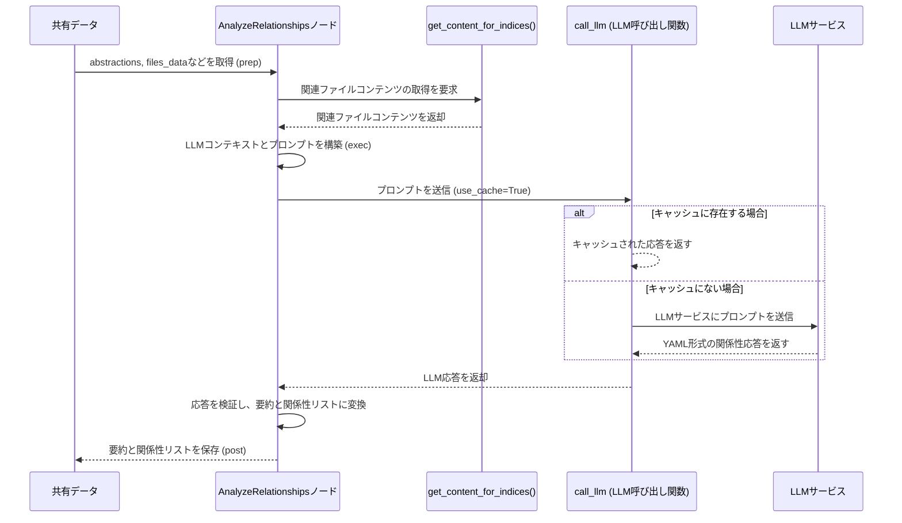
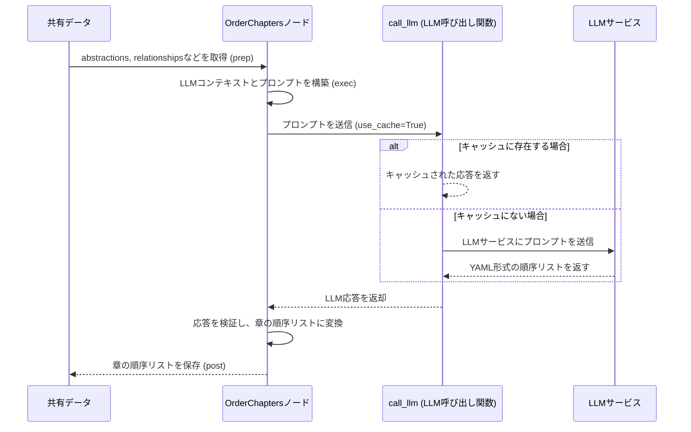

# Chapter 5: 関係分析と順序付け

前章の[抽象化特定](04_抽象化特定_.md)では、`PocketFlow-Tutorial-Codebase-Knowledge-HITL` プロジェクトが、コードベースからその核となる重要な概念（抽象化）をどのように見つけ出すかを学びました。まるで、複雑な機械の部品を一つ一つ特定していくようなものでしたね。しかし、部品をすべてリストアップしただけでは、その機械がどう動くのか、どのように組み立てるべきかはまだわかりません。

本章では、特定されたこれらの抽象化が**どのように相互作用し合うのかを分析し、チュートリアルでそれらを提示する最も論理的な順序を決定する**という、次の重要なステップ「**関係分析と順序付け**」について掘り下げていきます。これは、特定した部品（抽象化）がどのように接続し、連携して機能するのかを理解し、さらにそれらを最もわかりやすい形で組み立てていくプロセスです。

## 関係分析と順序付けとは？

このステップは、あなたのプロジェクトがまるで**ストーリーテラー**になったかのように機能します。前章でプロジェクトの主要な登場人物（抽象化）とその簡単なプロフィール（説明、関連ファイル）を特定しました。しかし、ストーリーを面白く、そして理解しやすくするためには、以下の情報が不可欠です。

1.  **登場人物同士の関係性**: どの登場人物が他の登場人物と協力するのか、あるいは対立するのか？（**関係分析**）
2.  **ストーリー展開の順序**: どの出来事を最初に語り、次に何を語れば、読者が最もスムーズに物語を理解できるのか？（**順序付け**）

`PocketFlow` プロジェクトにおける「関係分析と順序付け」とは、特定された抽象化同士がどのように連携しているかを理解し、その理解に基づいて、チュートリアルとして説明するのに最適な順番を決定するプロセスを指します。これにより、読者はプロジェクトの全体像を把握し、基礎から応用へと無理なく学習を進めることができます。

### なぜ関係分析と順序付けが必要なのか？

*   **プロジェクトの全体像を理解する**: 個々の抽象化だけでは、プロジェクトが全体として何を達成しようとしているのか、どのように動作するのかはわかりません。関係性を分析することで、プロジェクトのアーキテクチャやデータの流れを俯瞰的に理解できます。
*   **学習のロードマップを作成する**: チュートリアルは、読者が新しい知識を段階的に積み上げていけるよう構成されるべきです。順序付けによって、「まずこれを理解してから次にこれに進む」という明確な学習パスを提供できます。
*   **認知負荷の軽減**: 相互に関連性の高い概念を適切な順序で提示することで、読者は一度に処理すべき情報量を減らし、より効率的に学習できます。

このプロセスを通じて、個々の「部品」が「システム」としてどのように機能するのかが明らかになり、それを読者に伝えるための「最も効果的な説明書」の骨格が形成されます。

## 内部実装：`AnalyzeRelationships`ノードと`OrderChapters`ノードの動作

`PocketFlow`プロジェクトでは、`AnalyzeRelationships`ノードと`OrderChapters`ノードが、この関係分析と順序付けの役割を担っています。[チュートリアル生成ワークフロー](01_チュートリアル生成ワークフロー_.md)で見たように、これらのノードは`IdentifyAbstractions`ノードの出力（特定された抽象化のリスト）を次の入力として受け取ります。

### 1. `AnalyzeRelationships`ノード：関係性の特定

このノードは、まるで**探偵**のように、特定された抽象化とその関連コードスニペットを詳細に調べ、それらがどのように連携しているかを手がかりから推測します。

#### 処理のシーケンス

`AnalyzeRelationships`ノードが実行されるときの基本的な流れは以下の通りです。

1.  **`prep`メソッド**:
    *   `shared`辞書から、前章で特定された`abstractions`（抽象化のリスト）と、`FetchRepo`ノードが収集した`files_data`（コードファイルの内容）、`project_name`、`language`、`use_cache`などの情報を取得します。
    *   LLMに渡すための`context`文字列を構築します。このコンテキストには、各抽象化のインデックス、名前、説明に加えて、それらに関連するコードスニペットが含まれます。これは、LLMが関係性を推論するための最も重要な情報源となります。
2.  **`exec`メソッド**:
    *   `prep`メソッドで準備された`context`から、LLMにプロジェクトの「要約」と「抽象化間の関係」を依頼する具体的な「プロンプト」を生成します。プロンプトでは、各関係に`from_abstraction`（送信元）、`to_abstraction`（受信先）、そして`label`（関係性を示す短い言葉）を含めるよう指示します。
    *   また、プロジェクトの全体像をまとめた「要約」も生成するよう依頼します。
    *   生成されたプロンプトを`call_llm`関数（[LLMインタラクションとキャッシュ](02_llmインタラクションとキャッシュ_.md)で学んだ関数）に渡してLLMを呼び出します。
    *   LLMからの応答（YAML形式の文字列）を受け取ります。
    *   受け取ったYAML文字列を解析し、その構造や内容（例: `summary`フィールドと`relationships`リストが存在するか、各関係性のインデックスが有効な範囲内かなど）が期待通りであるかを厳密に検証します。
    *   検証を通過した要約と関係性の詳細を返します。
3.  **`post`メソッド**:
    *   `exec`メソッドから返された要約と関係性の詳細を、`shared["relationships"]`として共有メモリに保存します。この情報が、次のノードである`OrderChapters`の入力となります。

この流れをMermaidシーケンス図で視覚化すると、次のようになります。



#### コードスニペットの解説 (`nodes.py`)

`nodes.py`内の`AnalyzeRelationships`ノードの主要な部分を見てみましょう。

```python
# nodes.py からの抜粋
class AnalyzeRelationships(Node):
    def prep(self, shared):
        abstractions = shared["abstractions"]
        files_data = shared["files"]
        project_name = shared["project_name"]
        language = shared.get("language", "english")
        use_cache = shared.get("use_cache", True)

        # 抽象化の名前、説明、関連ファイルインデックスからコンテキストを作成
        context = "特定された抽象化:\\n"
        all_relevant_indices = set()
        abstraction_info_for_prompt = []
        for i, abstr in enumerate(abstractions):
            file_indices_str = ", ".join(map(str, abstr["files"]))
            info_line = f"- インデックス {i}: {abstr['name']} (関連ファイルインデックス: [{file_indices_str}])\\n  説明: {abstr['description']}"
            context += info_line + "\\n"
            abstraction_info_for_prompt.append(f"{i} # {abstr['name']}")
            all_relevant_indices.update(abstr["files"])

        # 関連ファイルスニペットのコンテンツを取得し、コンテキストに追加
        context += "\\n関連ファイルスニペット (インデックスとパスで参照):\\n"
        relevant_files_content_map = get_content_for_indices( # ヘルパー関数でファイルコンテンツを取得
            files_data, sorted(list(all_relevant_indices))
        )
        file_context_str = "\\n\\n".join(
            f"--- ファイル: {idx_path} ---\\n{content}"
            for idx_path, content in relevant_files_content_map.items()
        )
        context += file_context_str

        return (
            context,
            "\n".join(abstraction_info_for_prompt),
            len(abstractions), # 抽象化の実際の数を渡す
            project_name,
            language,
            use_cache,
        )

    def exec(self, prep_res):
        (
            context,
            abstraction_listing,
            num_abstractions,
            project_name,
            language,
            use_cache,
         ) = prep_res
        print(f"LLMを使用して関係性を分析しています...")

        # 日本語での指示とヒントをプロンプトに追加
        language_instruction = ""
        lang_hint = ""
        list_lang_note = ""
        if language.lower() != "english":
            language_instruction = f"重要: プロジェクトの`summary`と関係性の`label`フィールドは**{language.capitalize()}**で生成してください。これらのフィールドには英語を使用しないでください。\n\n"
            lang_hint = f" ({language.capitalize()}での値)"
            list_lang_note = f" (名前は{language.capitalize()}の場合があります)"

        prompt = f"""
以下のプロジェクト`{project_name}`の抽象化と関連するコードスニペットに基づいて、情報を生成してください:

抽象化のインデックスと名前のリスト{list_lang_note}:
{abstraction_listing}

コンテキスト (抽象化、説明、コード):
{context}

{language_instruction}以下を提供してください:
1. プロジェクトの主な目的と機能の**高レベルな要約**を、初心者にもわかりやすい数文で提供してください{lang_hint}。重要な概念を強調するために、Markdownの**太字**や*斜体*を使用してください。
2. これらの抽象化間の主要な相互作用を記述するリスト (`relationships`) を提供してください。各関係について、以下を指定してください:
    - `from_abstraction`: ソース抽象化のインデックス (例: `0 # 抽象化名1`)
    - `to_abstraction`: ターゲット抽象化のインデックス (例: `1 # 抽象化名2`)
    - `label`: 相互作用を簡潔に示す短いラベル**数語で**{lang_hint} (例: 「管理する」、「継承する」、「使用する」)。
    理想的には、関係性は、ある抽象化が別の抽象化を呼び出したり、パラメータを渡したりすることによって裏付けられるべきです。
    関係性を単純化し、重要でないものは除外してください。

重要: すべての抽象化が少なくとも1つの関係性（ソースまたはターゲットのいずれか）に含まれていることを確認してください。各抽象化インデックスは、すべての関係性の中で少なくとも1回は登場する必要があります。

出力をYAML形式でフォーマットしてください:

```yaml
summary: |
  プロジェクトの簡潔でわかりやすい説明{lang_hint}。
  強調のために**太字**と*斜体*を使用し、複数行にわたっても構いません。
relationships:
  - from_abstraction: 0 # 抽象化名1
    to_abstraction: 1 # 抽象化名2
    label: "管理する"{lang_hint}
  - from_abstraction: 2 # 抽象化名3
    to_abstraction: 0 # 抽象化名1
    label: "設定を提供する"{lang_hint}
  # ... 他の関係性
```

さあ、YAML出力を提供してください:
"""
        response = call_llm(prompt, use_cache=(use_cache and self.cur_retry == 0))

        # --- 検証 (Validation) ---
        # LLMの応答からYAML部分を抽出し、パースする
        yaml_str = response.strip().split("```yaml")[1].split("```")[0].strip()
        relationships_data = yaml.safe_load(yaml_str)

        # 応答の構造と内容を検証するロジック (省略)
        # 例えば、'summary'と'relationships'キーの存在、リストの要素、インデックスの妥当性などをチェック
        # ...

        print("プロジェクトの要約と関係性の詳細を生成しました。")
        return {
            "summary": relationships_data["summary"],
            "details": validated_relationships, # 検証済みかつインデックスベースの関係性
        }

    def post(self, shared, prep_res, exec_res):
        shared["relationships"] = exec_res # 要約と関係性の詳細を共有データに保存
```

このコードでは、`prep`メソッドがLLMに渡すための詳細なコンテキストを準備し、`exec`メソッドがそのコンテキストと特定の指示（日本語での出力要求や関係性のルールなど）を含むプロンプトを作成しているのがわかります。特に、`get_content_for_indices`ヘルパー関数が、関係性分析に必要なコードスニペットを効率的に取得しています。

### 2. `OrderChapters`ノード：章の順序付け

関係性が特定されたら、次に**どの抽象化から説明を始めるべきか、そしてどのような順番で進めるべきか**を決定します。このノードは、まるで**カリキュラムデザイナー**のように、学習者の理解度を最大化するチュートリアルの流れを考案します。

#### 処理のシーケンス

`OrderChapters`ノードが実行されるときの基本的な流れは以下の通りです。

1.  **`prep`メソッド**:
    *   `shared`辞書から、特定された`abstractions`と、`AnalyzeRelationships`ノードが保存した`relationships`（要約と関係性の詳細）、`project_name`、`language`、`use_cache`などの情報を取得します。
    *   LLMに渡すための`context`文字列を構築します。このコンテキストには、抽象化のリスト、プロジェクトの要約、そして抽象化間の関係性が含まれます。
2.  **`exec`メソッド**:
    *   `prep`メソッドで準備された`context`から、LLMに「チュートリアルとして最適な章の順序」を決定する具体的な「プロンプト」を生成します。プロンプトでは、まず最も重要または基本的な概念から説明し、徐々に詳細な実装やサポート概念へと進むよう指示します。
    *   生成されたプロンプトを`call_llm`関数に渡してLLMを呼び出します。
    *   LLMからの応答（YAML形式の、抽象化インデックスのリスト）を受け取ります。
    *   受け取ったYAML文字列を解析し、その構造や内容（例: すべての抽象化インデックスが含まれているか、重複がないか、有効な範囲内かなど）が期待通りであるかを厳密に検証します。
    *   検証を通過した順序付けられた抽象化インデックスのリストを返します。
3.  **`post`メソッド**:
    *   `exec`メソッドから返された順序付けられた抽象化インデックスのリストを、`shared["chapter_order"]`として共有メモリに保存します。このリストが、最終的なチュートリアルの章立ての順序となります。

この流れをMermaidシーケンス図で視覚化すると、次のようになります。



#### コードスニペットの解説 (`nodes.py`)

`nodes.py`内の`OrderChapters`ノードの主要な部分を見てみましょう。

```python
# nodes.py からの抜粋
class OrderChapters(Node):
    def prep(self, shared):
        abstractions = shared["abstractions"]
        relationships = shared["relationships"]
        project_name = shared["project_name"]
        language = shared.get("language", "english")
        use_cache = shared.get("use_cache", True)

        # LLMへのコンテキストを準備
        abstraction_info_for_prompt = []
        for i, a in enumerate(abstractions):
            abstraction_info_for_prompt.append(f"- {i} # {a['name']}")
        abstraction_listing = "\n".join(abstraction_info_for_prompt)

        # プロジェクトの要約と関係性をコンテキストに追加
        summary_note = ""
        if language.lower() != "english":
            summary_note = f" (注: プロジェクトの要約は{language.capitalize()}の場合があります)"

        context = f"プロジェクトの要約{summary_note}:\n{relationships['summary']}\n\n"
        context += "関係性 (インデックスは上記の抽象化を参照):\n"
        for rel in relationships["details"]:
            from_name = abstractions[rel["from"]]["name"]
            to_name = abstractions[rel["to"]]["name"]
            context += f"- {rel['from']} ({from_name}) から {rel['to']} ({to_name}) へ: {rel['label']}\n"

        list_lang_note = ""
        if language.lower() != "english":
            list_lang_note = f" (名前は{language.capitalize()}の場合があります)"

        return (
            abstraction_listing,
            context,
            len(abstractions),
            project_name,
            list_lang_note,
            use_cache,
        )

    def exec(self, prep_res):
        (
            abstraction_listing,
            context,
            num_abstractions,
            project_name,
            list_lang_note,
            use_cache,
        ) = prep_res
        print("LLMを使用して章の順序を決定しています...")
        
        prompt = f"""
プロジェクト`{project_name}`について、以下の抽象化とその関係性を考慮し、
チュートリアルを作成する場合、これらの抽象化を最初から最後まですべて説明するのに最適な順序は何ですか？

抽象化 (インデックス # 名前){list_lang_note}:
{abstraction_listing}

関係性およびプロジェクトの要約に関するコンテキスト:
{context}

理想的には、まず最も重要または基本的な概念、例えばユーザー向けの概念やエントリポイントを説明します。
次に、より詳細な、低レベルの実装の詳細やサポート概念へと進みます。

出力を、抽象化インデックスの順序付きリストとして提供してください。
分かりやすくするために、コメントで名前を含めてください。
形式は `idx # AbstractionName` を使用してください。

```yaml
- 2 # 基盤となる概念
- 0 # コアクラスA
- 1 # コアクラスB (コアクラスAを使用)
- ...
```

さあ、YAML出力を提供してください:
"""
        response = call_llm(prompt, use_cache=(use_cache and self.cur_retry == 0))

        # --- 検証 (Validation) ---
        # LLMの応答からYAML部分を抽出し、パースする
        yaml_str = response.strip().split("```yaml")[1].split("```")[0].strip()
        ordered_indices_raw = yaml.safe_load(yaml_str)

        # 応答の構造と内容を検証するロジック (省略)
        # 例えば、リストであること、すべての抽象化インデックスが含まれていること、重複がないことなどをチェック
        # ...

        print(f"決定された章の順序 (インデックス): {ordered_indices}")
        return ordered_indices

    def post(self, shared, prep_res, exec_res):
        shared["chapter_order"] = exec_res # 順序付けられたインデックスのリストを共有データに保存
```

`OrderChapters`ノードの`exec`メソッドでは、LLMに対して、チュートリアルとして理解しやすい「学習経路」を設計するよう指示しています。このプロンプトは、単にインデックスのリストを求めるだけでなく、どのような基準で順序を決定すべきか（「最も重要または基本的」から「詳細な実装」へ）というヒントを与えている点が重要です。これにより、LLMはより教育的な観点から最適な順序を提案することができます。

## まとめ

本章では、`PocketFlow`プロジェクトがどのようにして、特定された抽象化同士の**関係性を分析し、チュートリアルの最適な章順序を決定する**のかを学びました。

*   `AnalyzeRelationships`ノードが、LLMの力を借りて、プロジェクトの全体的な「要約」と、抽象化間の具体的な「関係性」（誰が誰を「管理する」のか、誰が誰に「データを提供する」のか、など）を特定すること。
*   `OrderChapters`ノードが、これらの関係性と抽象化の詳細に基づいて、学習者が最も効果的に理解できるような章の「順序」を決定すること。
*   まるで、ストーリーテラーが物語の登場人物の関係性を理解し、読者を惹きつける最適なプロットの順序を考えるように、このステップはコードベースの知識を初心者向けのわかりやすい物語へと変換する上で不可欠です。

これで、チュートリアルの「内容」（抽象化）と「構成」（関係性、順序）の骨格が完成しました。次章では、この骨格に肉付けをするステップ、つまり[チュートリアル章生成](06_チュートリアル章生成_.md)について詳しく見ていきましょう。

---

**次章へのリンク:** [Chapter 6: チュートリアル章生成](06_チュートリアル章生成_.md)

---

Generated by [AI Codebase Knowledge Builder](https://github.com/The-Pocket/Tutorial-Codebase-Knowledge)