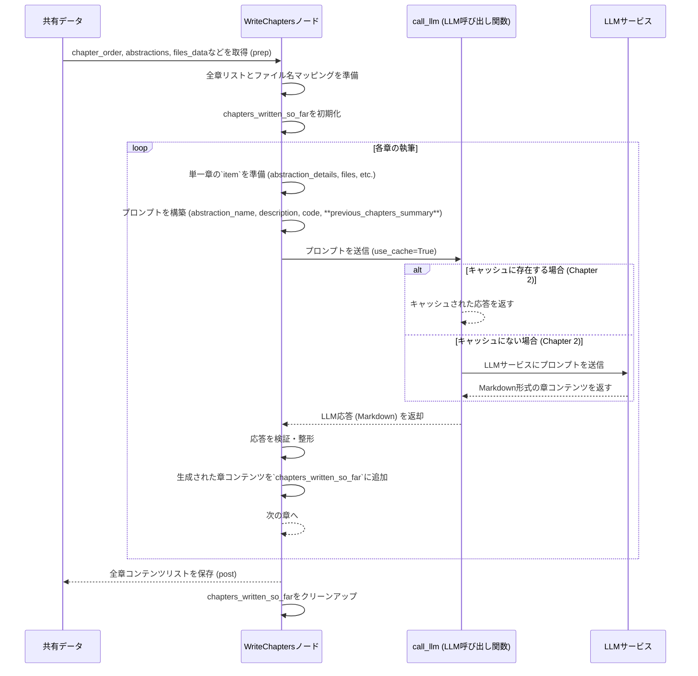

# Chapter 6: チュートリアル章生成

前章の[関係分析と順序付け](05_関係分析と順序付け_.md)では、`PocketFlow-Tutorial-Codebase-Knowledge-HITL` プロジェクトが、コードベースから特定された抽象化間の関係性をどのように分析し、チュートリアルとして最適な章の順序を決定するのかを学びました。これは、まるで物語の登場人物の関係性を理解し、読者を惹きつける最適なプロットの順序を考えるストーリーテラーのようでした。

これでチュートリアルの「内容」（抽象化）と「構成」（関係性、順序）の骨格が完成しました。しかし、これはまだ「骨」に過ぎません。この骨格に肉付けをし、実際の魅力的な文章やコード例、図、そしてスムーズな章間のつながりを持つレッスンへと変えるのが、本章のテーマである**チュートリアル章生成**の役割です。

## チュートリアル章生成とは？

チュートリアル章生成は、LLM（大規模言語モデル）が特定された各抽象化について、個別のチュートリアル章を執筆する、プロジェクトにおける**創造性の核**となる部分です。

これは、まるで**生のメモや研究資料を受け取り、初心者向けの魅力的で分かりやすい教科書の章に変える、専門の著者**のようなものだと考えてください。この「著者」は、以下の要素を組み合わせて、各抽象化についての一貫性のある章を作成します。

*   **概念と説明**: 各抽象化の名前と、その初心者向けの説明。
*   **関連コードスニペット**: その抽象化を実装する、または密接に関連するコード。
*   **チュートリアルの構造**: 全体の章のリストと、前後の章に関する情報。
*   **過去の章の要約**: これまでに執筆された章の内容。

このステップは、単に情報を羅列するのではなく、読者が段階的に学習を進められるよう、類推、具体的なコード例、図、そしてスムーズな論理展開を用いて、理解を促進することを目的としています。

### なぜチュートリアル章生成が必要なのか？

*   **知識を「物語」にする**: 抽象化や関係性だけでは、まだ無味乾燥な情報です。これを読者が共感し、理解できる「物語」に変えることで、学習意欲を高め、深い理解を促します。
*   **初心者向けの解説**: 複雑な技術的概念を、専門家ではない読者でも容易に吸収できるレベルにまで噛み砕いて説明します。
*   **一貫性と連結性**: 各章が独立していても、全体のチュートリアルとしての一貫性と、章間のスムーズな連携が保たれるようにします。これにより、読者は迷うことなく学習パスを辿ることができます。
*   **コードと理論の橋渡し**: 実際のコードと、その背後にある概念や設計思想を結びつけ、実践的な理解を深めます。

## 内部実装：`WriteChapters`ノードの動作

`PocketFlow`プロジェクトでは、`WriteChapters`ノードがこのチュートリアル章生成の役割を担っています。このノードは、[関係分析と順序付け](05_関係分析と順序付け_.md)で決定された章の順序に基づいて、各抽象化について個別のMarkdown形式のチュートリアル章を生成します。

特に注目すべきは、`WriteChapters`が`Node`ではなく**`BatchNode`**である点です。`BatchNode`は、複数の関連するタスク（この場合は各章の執筆）を独立して実行しながらも、そのタスク間で情報を共有できるという特徴があります。これにより、各章の執筆時に、それまでに生成された章の要約を参照できるようになります。

### 処理のシーケンス

`WriteChapters`ノードが実行されるときの基本的な流れは以下の通りです。

1.  **`prep`メソッド**:
    *   `shared`辞書から、`chapter_order`（章の順序）、`abstractions`（抽象化の詳細）、`files_data`（コードファイルの内容）、`project_name`、`language`、`use_cache`などの必要な情報を取得します。
    *   すべての章のリストと、各章のファイル名マッピング（`chapter_filenames`）を作成します。これは、章間のMarkdownリンクを正しく生成するために必要です。
    *   各章を執筆するための入力データ（`item_to_process`）のリストを作成します。このリストには、章番号、抽象化の詳細、関連ファイルコンテンツ、プロジェクト名、完全な章リスト、前後の章の情報などが含まれます。
    *   `self.chapters_written_so_far`というインスタンス変数を初期化します。これは、すでに執筆された章の要約を一時的に保持するために使用され、後続の章のLLMプロンプトにコンテキストとして渡されます。
2.  **`exec`メソッド (各章ごとに実行)**:
    *   `prep`メソッドで作成された`item`（単一の章を執筆するためのすべての情報）を受け取ります。
    *   現在の章の抽象化の名前、説明、関連ファイルコンテンツ、プロジェクト名、言語、そして**それまでに執筆された章の要約**（`previous_chapters_summary`）をすべて含んだ、非常に詳細なLLMプロンプトを構築します。このプロンプトには、章の構成、コードブロックのガイドライン、図の使用、類推の使用、章間のリンク方法など、チュートリアル執筆に関するあらゆる指示が含まれます。
    *   構築したプロンプトを`call_llm`関数（[LLMインタラクションとキャッシュ](02_llmインタラクションとキャッシュ_.md)で学んだ関数）に渡してLLMを呼び出します。
    *   LLMからの応答（Markdown形式の章コンテンツ）を受け取ります。
    *   基本的な検証と整形（例: 見出しの確認と修正）を行います。
    *   **重要**: 生成された章コンテンツを`self.chapters_written_so_far`に追加します。これにより、次の章を執筆する際に、この章の内容が「これまでのコンテキスト」として利用できるようになります。
    *   生成されたMarkdown文字列を返します。
3.  **`post`メソッド**:
    *   `exec`メソッドから返されたすべての章コンテンツ（Markdown文字列のリスト）を収集し、`shared["chapters"]`として共有メモリに保存します。
    *   一時的に使用した`self.chapters_written_so_far`をクリーンアップします。

この流れをMermaidシーケンス図で視覚化すると、特に`exec`メソッドの繰り返しと`self.chapters_written_so_far`の利用が明確になります。



### コードスニペットの解説 (nodes.py)

`nodes.py`内の`WriteChapters`ノードの主要な部分を見てみましょう。

```python
# --- File: nodes.py ---
# ... (他のインポートやクラス定義は省略) ...

class WriteChapters(BatchNode):
    def prep(self, shared):
        chapter_order = shared["chapter_order"]  # 順序付けられた抽象化インデックスのリスト
        abstractions = shared["abstractions"]  # 抽象化の詳細リスト
        files_data = shared["files"]  # コードファイルの内容
        project_name = shared["project_name"]
        language = shared.get("language", "english")
        use_cache = shared.get("use_cache", True)

        # 執筆済みの章を一時的に保存するインスタンス変数を初期化
        # これにより、後続の章のプロンプトに前の章のコンテキストを提供できます
        self.chapters_written_so_far = []

        # 全ての章のリストとファイル名マッピングを作成
        all_chapters = []
        chapter_filenames = {} # 章のインデックスからファイル名へのマッピング
        for i, abstraction_index in enumerate(chapter_order):
            if 0 <= abstraction_index < len(abstractions):
                chapter_num = i + 1
                chapter_name = abstractions[abstraction_index]["name"] # 翻訳済みかもしれない名前
                # ファイル名として安全な名前に変換
                safe_name = "".join(
                    c if c.isalnum() else "_" for c in chapter_name
                ).lower()
                filename = f"{i+1:02d}_{safe_name}.md"
                # Markdownリンク形式で章リストに追加
                all_chapters.append(f"{chapter_num}. [{chapter_name}]({filename})")
                chapter_filenames[abstraction_index] = {
                    "num": chapter_num,
                    "name": chapter_name,
                    "filename": filename,
                }

        # LLMに渡すための完全な章リスト文字列
        full_chapter_listing = "\n".join(all_chapters)

        items_to_process = []
        for i, abstraction_index in enumerate(chapter_order):
            if 0 <= abstraction_index < len(abstractions):
                abstraction_details = abstractions[abstraction_index] # 翻訳済み名前/説明を含む
                related_file_indices = abstraction_details.get("files", [])
                # 関連ファイルの内容を取得
                related_files_content_map = get_content_for_indices(
                    files_data, related_file_indices
                )

                # 前後の章の情報を取得（リンク生成用）
                prev_chapter = None
                if i > 0:
                    prev_idx = chapter_order[i - 1]
                    prev_chapter = chapter_filenames[prev_idx]

                next_chapter = None
                if i < len(chapter_order) - 1:
                    next_idx = chapter_order[i + 1]
                    next_chapter = chapter_filenames[next_idx]

                items_to_process.append(
                    {
                        "chapter_num": i + 1,
                        "abstraction_index": abstraction_index,
                        "abstraction_details": abstraction_details,
                        "related_files_content_map": related_files_content_map,
                        "project_name": shared["project_name"],
                        "full_chapter_listing": full_chapter_listing,
                        "chapter_filenames": chapter_filenames,
                        "prev_chapter": prev_chapter,
                        "next_chapter": next_chapter,
                        "language": language,
                        "use_cache": use_cache,
                    }
                )
            else:
                print(
                    f"Warning: Invalid abstraction index {abstraction_index} in chapter_order. Skipping."
                )

        print(f"{len(items_to_process)}章の執筆を準備しています...")
        return items_to_process # BatchNodeのイテラブルとして返却

    def exec(self, item):
        # ここで各章の執筆が行われます
        abstraction_name = item["abstraction_details"]["name"] # 翻訳済みかもしれない名前
        abstraction_description = item["abstraction_details"]["description"] # 翻訳済みかもしれない説明
        chapter_num = item["chapter_num"]
        project_name = item.get("project_name")
        language = item.get("language", "english")
        use_cache = item.get("use_cache", True)
        print(f"LLMを使用してチャプター {chapter_num} ({abstraction_name}) を執筆中...")

        # 関連ファイルの内容を整形
        file_context_str = "\n\n".join(
            f"--- File: {idx_path.split('# ')[1] if '# ' in idx_path else idx_path} ---\n{content}"
            for idx_path, content in item["related_files_content_map"].items()
        )

        # これまでに執筆された章の要約を取得
        # これがBatchNodeの最大の利点の一つです
        previous_chapters_summary = "\n---\n".join(self.chapters_written_so_far)

        # プロンプトの言語指示部分
        language_instruction = ""
        concept_details_note = ""
        structure_note = ""
        prev_summary_note = ""
        instruction_lang_note = ""
        mermaid_lang_note = ""
        code_comment_note = ""
        link_lang_note = ""
        tone_note = ""
        if language.lower() != "english":
            lang_cap = language.capitalize()
            language_instruction = f"IMPORTANT: Write this ENTIRE tutorial chapter in **{lang_cap}**. Some input context (like concept name, description, chapter list, previous summary) might already be in {lang_cap}, but you MUST translate ALL other generated content including explanations, examples, technical terms, and potentially code comments into {lang_cap}. DO NOT use English anywhere except in code syntax, required proper nouns, or when specified. The entire output MUST be in {lang_cap}.\n\n"
            concept_details_note = f" (Note: Provided in {lang_cap})"
            structure_note = f" (Note: Chapter names might be in {lang_cap})"
            prev_summary_note = f" (Note: This summary might be in {lang_cap})"
            instruction_lang_note = f" (in {lang_cap})"
            mermaid_lang_note = f" (Use {lang_cap} for labels/text if appropriate)"
            code_comment_note = f" (Translate to {lang_cap} if possible, otherwise keep minimal English for clarity)"
            link_lang_note = (
                f" (Use the {lang_cap} chapter title from the structure above)"
            )
            tone_note = f" (appropriate for {lang_cap} readers)"

        prompt = f"""
{language_instruction}Write a very beginner-friendly tutorial chapter (in Markdown format) for the project `{project_name}` about the concept: "{abstraction_name}". This is Chapter {chapter_num}.

Concept Details{concept_details_note}:
- Name: {abstraction_name}
- Description:
{abstraction_description}

Complete Tutorial Structure{structure_note}:
{item["full_chapter_listing"]}

Context from previous chapters{prev_summary_note}:
{previous_chapters_summary if previous_chapters_summary else "This is the first chapter."}

Relevant Code Snippets (Code itself remains unchanged):
{file_context_str if file_context_str else "No specific code snippets provided for this abstraction."}

Instructions for the chapter (Generate content in {language.capitalize()} unless specified otherwise):
- Start with a clear heading (e.g., `# Chapter {chapter_num}: {abstraction_name}`). Use the provided concept name.

- If this is not the first chapter, begin with a brief transition from the previous chapter{instruction_lang_note}, referencing it with a proper Markdown link using its name{link_lang_note}.

- Begin with a high-level motivation explaining what problem this abstraction solves{instruction_lang_note}. Start with a central use case as a concrete example. The whole chapter should guide the reader to understand how to solve this use case. Make it very minimal and friendly to beginners.

- If the abstraction is complex, break it down into key concepts. Explain each concept one-by-one in a very beginner-friendly way{instruction_lang_note}.

- Explain how to use this abstraction to solve the use case{instruction_lang_note}. Give example inputs and outputs for code snippets (if the output isn't values, describe at a high level what will happen{instruction_lang_note}).

- Each code block should be BELOW 10 lines! If longer code blocks are needed, break them down into smaller pieces and walk through them one-by-one. Aggresively simplify the code to make it minimal. Use comments{code_comment_note} to skip non-important implementation details. Each code block should have a beginner friendly explanation right after it{instruction_lang_note}.

- Describe the internal implementation to help understand what's under the hood{instruction_lang_note}. First provide a non-code or code-light walkthrough on what happens step-by-step when the abstraction is called{instruction_lang_note}. It's recommended to use a simple sequenceDiagram with a dummy example - keep it minimal with at most 5 participants to ensure clarity. If participant name has space, use: `participant QP as Query Processing`. {mermaid_lang_note}.

- Then dive deeper into code for the internal implementation with references to files. Provide example code blocks, but make them similarly simple and beginner-friendly. Explain{instruction_lang_note}.

- IMPORTANT: When you need to refer to other core abstractions covered in other chapters, ALWAYS use proper Markdown links like this: [Chapter Title](filename.md). Use the Complete Tutorial Structure above to find the correct filename and the chapter title{link_lang_note}. Translate the surrounding text.

- Use mermaid diagrams to illustrate complex concepts (```mermaid``` format). {mermaid_lang_note}.

- Heavily use analogies and examples throughout{instruction_lang_note} to help beginners understand.

- End the chapter with a brief conclusion that summarizes what was learned{instruction_lang_note} and provides a transition to the next chapter{instruction_lang_note}. If there is a next chapter, use a proper Markdown link: [Next Chapter Title](next_chapter_filename){link_lang_note}.

- Ensure the tone is welcoming and easy for a newcomer to understand{tone_note}.

- Output *only* the Markdown content for this chapter.

Now, directly provide a super beginner-friendly Markdown output (DON'T need ```markdown``` tags):
"""
        chapter_content = call_llm(prompt, use_cache=(use_cache and self.cur_retry == 0))
        # 基本的な検証/クリーンアップ
        actual_heading = f"# Chapter {chapter_num}: {abstraction_name}"
        if not chapter_content.strip().startswith(f"# Chapter {chapter_num}"):
            lines = chapter_content.strip().split("\n")
            if lines and lines[0].strip().startswith("#"):
                lines[0] = actual_heading
                chapter_content = "\n".join(lines)
            else:
                chapter_content = f"{actual_heading}\n\n{chapter_content}"

        # 生成されたコンテンツを一時リストに追加 (次のイテレーションのコンテキストとして使用)
        self.chapters_written_so_far.append(chapter_content)

        return chapter_content # Markdown文字列を返却

    def post(self, shared, prep_res, exec_res_list):
        # exec_res_listには、各章の生成されたMarkdownが順序通り含まれます
        shared["chapters"] = exec_res_list
        # 一時インスタンス変数をクリーンアップ
        del self.chapters_written_so_far
        print(f"{len(exec_res_list)}章の執筆が完了しました。")
```

`exec`メソッド内のLLMへのプロンプトは非常に包括的であり、以下のような詳細な指示が含まれていることがわかります。

*   **ターゲット言語の指定**: 日本語で出力することの重要性を繰り返し強調しています。
*   **構造化されたコンテンツ**: 見出し、導入、使用例、内部実装、結論といった章の標準的な構成を指示しています。
*   **教育的アプローチ**: 初心者向けの類推や例の使用、複雑な概念の分解を推奨しています。
*   **コードの扱い**: 10行未満の簡潔なコードブロック、非重要部分の省略、各コード後の説明を求めています。
*   **図の使用**: Mermaidシーケンス図や他の図を、明確な指示とともに奨励しています。
*   **章間リンク**: 他の章を参照する際に、[章のタイトル](ファイル名.md)というMarkdownリンクを正確に使用することを義務付けています。これにより、生成されるチュートリアルが相互にリンクされた読みやすいものになります。
*   **コンテキストの活用**: `previous_chapters_summary`を用いて、これまでに説明された内容を考慮するようLLMに促しています。

これらの指示がLLMに与えられることで、個々の抽象化に関する情報が、単なる説明文ではなく、読者の学習体験を考慮した、本格的なチュートリアル章へと昇華されるのです。

## まとめ

本章では、`PocketFlow`プロジェクトの最も創造的な部分である**チュートリアル章生成**について学びました。

*   `WriteChapters`ノードが、特定された各抽象化とその関連コードスニペット、そしてこれまでの章のコンテキストを受け取り、LLMの力を借りて個別のMarkdown形式のチュートリアル章を生成することを理解しました。
*   このノードが`BatchNode`として機能し、`self.chapters_written_so_far`を通じて、章を順番に執筆しながら「これまでの知識」を次の章の執筆に活用している点に注目しました。
*   LLMへの詳細なプロンプトが、チュートリアルとしての品質（初心者向け、コード例、図、章間リンク、スムーズな流れなど）を確保するためにいかに重要であるかを学びました。

これで、プロジェクトはコードベースの知識を抽出し、論理的に構成し、個々の章として執筆するという主要なタスクを完了しました。次章では、これらすべての個別の章をまとめ上げ、最終的なチュートリアルとして出力するステップ、つまり[最終チュートリアル組み立て](07_最終チュートリアル組み立て_.md)について詳しく見ていきましょう。

---

**次章へのリンク:** [Chapter 7: 最終チュートリアル組み立て](07_最終チュートリアル組み立て_.md)

---

Generated by [AI Codebase Knowledge Builder](https://github.com/The-Pocket/Tutorial-Codebase-Knowledge)