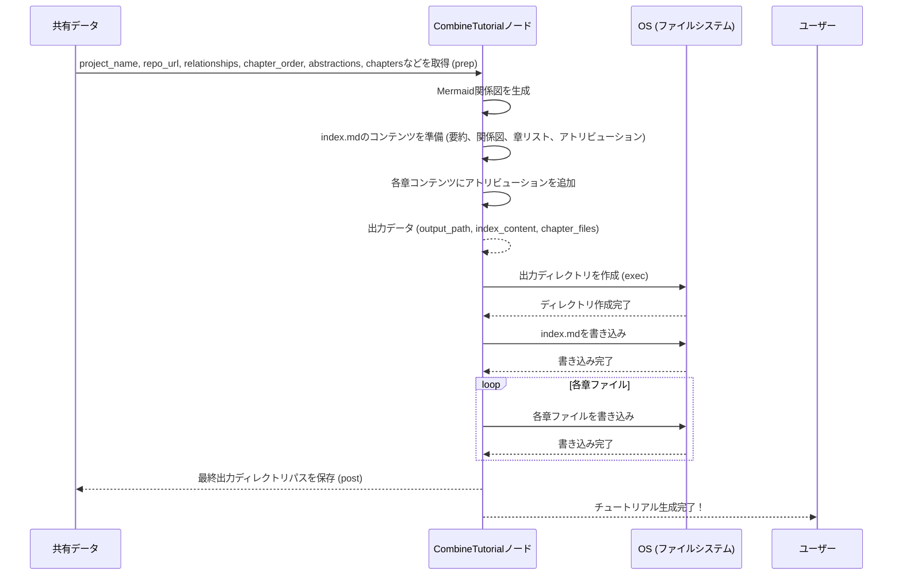

# Chapter 7: 最終チュートリアル組み立て

前章の[チュートリアル章生成](06_チュートリアル章生成_.md)では、`PocketFlow-Tutorial-Codebase-Knowledge-HITL` プロジェクトが、特定された各抽象化に基づいて個別のMarkdown形式のチュートリアル章を生成する方法を学びました。これは、まるで熟練の著者が、詳細な調査資料を基に、読者にとって魅力的で分かりやすい教科書の章を次々と執筆していくようなものでしたね。

これで、プロジェクトはコードベースから知識を抽出し、論理的に構成し、個々の章として執筆するという主要なタスクを完了しました。しかし、これらの個別の章がバラバラのままでは、まだ「完全なチュートリアル」とは言えません。これらを一つのまとまりとして読者に提供するための最後の仕上げが、本章のテーマである**最終チュートリアル組み立て**です。

## 最終チュートリアル組み立てとは？

最終チュートリアル組み立てとは、個別に生成されたすべてのチュートリアル章、プロジェクトの概要、そして関係図といった要素を一つにまとめ上げ、完全にナビゲート可能なチュートリアルとして出力するプロセスです。

この抽象化は、まるで**印刷されたすべてのページを集め、序文と目次を追加し、それらを完成した一冊の本に製本する「製本業者」**のようなものです。この「製本業者」は、バラバラの素材を整理し、美しい装丁を施し、読者が最初から最後までスムーズに読み進められるように、以下のような準備を整えます。

*   **序文と目次**: チュートリアルの入り口となる`index.md`ファイルを作成し、プロジェクトの全体像を要約し、各章へのリンクを含む目次を提供します。
*   **章ファイルの配置**: 生成された各章のMarkdownファイルを、読みやすいファイル名で適切な出力ディレクトリに保存します。
*   **関係図の統合**: プロジェクトの主要な抽象化間の関係性を視覚的に示す図（Mermaid形式）を序文に埋め込みます。
*   **一貫したナビゲーション**: 各章の終わりには次の章へのリンク、最初の章には前章へのリンクがない、といったナビゲーション要素を適切に配置します。

### なぜ最終チュートリアル組み立てが必要なのか？

*   **完全な成果物の提供**: 個々の章は情報としては有用ですが、それだけでは体系的な学習体験を提供できません。このステップにより、ユーザーはダウンロードや閲覧が容易な「一冊の本」としてチュートリアルを受け取ることができます。
*   **学習体験の向上**: 序文、目次、そして章間のスムーズなナビゲーションは、読者が迷うことなく学習パスを辿り、プロジェクトの全体像をより深く理解する上で不可欠です。
*   **利便性の確保**: すべての関連ファイルが整理されたディレクトリに格納されることで、ユーザーはチュートリアルをローカルで簡単に閲覧したり、Gitリポジトリにアップロードしたりすることができます。
*   **プロジェクトの品質保証**: 最終的な出力物の構造と内容を検証し、ユーザーに提供するに足る品質であることを確認します。

この最後のステップは、これまでのすべての努力を集約し、コードベースの知識という「原石」を、初心者にとっての「輝く道しるべ」へと変える最終段階と言えるでしょう。

## 内部実装：`CombineTutorial`ノードの動作

`PocketFlow`プロジェクトでは、`CombineTutorial`ノードがこの最終チュートリアル組み立ての役割を担っています。このノードは、これまでに生成されたすべての情報を`shared`辞書から受け取り、最終的なファイルとして書き出します。

### 処理のシーケンス

`CombineTutorial`ノードが実行されるときの基本的な流れは以下の通りです。

1.  **`prep`メソッド**:
    *   `shared`辞書から、プロジェクト名、出力ベースディレクトリ、元のリポジトリURLなどの基本情報を取得します。
    *   以前のノードによって生成されたすべてのデータ、つまり`relationships`（プロジェクトの要約と関係性の詳細）、`chapter_order`（章の順序）、`abstractions`（抽象化の詳細）、`chapters`（各章のMarkdownコンテンツ）を取得します。これらの情報は、既に日本語に翻訳されている可能性があります。
    *   **Mermaid関係図の生成**: `abstractions`と`relationships`の情報に基づいて、Mermaid形式のフローチャート図を生成します。ノードのラベルには抽象化の名前、エッジのラベルには関係性のラベルを使用し、これらは翻訳済みのものをそのまま利用します。
    *   **`index.md`コンテンツの準備**: プロジェクトの要約、ソースリポジトリへのリンク、生成されたMermaid関係図、そして各章へのMarkdownリンクを含む`index.md`のコンテンツを作成します。各章へのリンクは、ファイル名と、翻訳された章のタイトルを使用します。
    *   **各章ファイルへのアトリビューション追加**: 生成された各章のコンテンツの末尾に、`PocketFlow`によって生成されたことを示すアトリビューション（英語の固定文字列）を追加します。
    *   出力パス、`index.md`のコンテンツ、そして各章のファイル名とそのコンテンツのリストを返します。
2.  **`exec`メソッド**:
    *   `prep`メソッドで準備された情報（出力パス、`index.md`コンテンツ、各章ファイルの情報）を受け取ります。
    *   指定された`output_path`にディレクトリを作成します（既に存在する場合は何もしません）。
    *   `index.md`ファイルを指定された出力パスに書き込みます。
    *   各章のファイル（`01_chapter_name.md`など）を、それぞれ適切なコンテンツとともに書き込みます。
    *   最後に、実際にファイルが書き込まれた最終的な出力ディレクトリのパスを返します。
3.  **`post`メソッド**:
    *   `exec`メソッドから返された最終出力ディレクトリのパスを、`shared["final_output_dir"]`として共有メモリに保存します。
    *   チュートリアル生成が完了したことをユーザーに通知します。

この流れをMermaidシーケンス図で視覚化すると、以下のようになります。



### コードスニペットの解説 (`nodes.py`)

`nodes.py`内の`CombineTutorial`ノードの主要な部分を見てみましょう。

```python
# --- File: nodes.py (抜粋) ---

# ... (他のクラス定義は省略) ...

class CombineTutorial(Node):
    def prep(self, shared):
        project_name = shared["project_name"]
        output_base_dir = shared.get("output_dir", "output")  # デフォルトの出力ディレクトリ
        output_path = os.path.join(output_base_dir, project_name) # プロジェクト名を含むパス
        repo_url = shared.get("repo_url")  # リポジトリURLを取得

        # 翻訳された可能性のあるデータを取得
        relationships_data = shared["relationships"] # 要約/ラベルが翻訳済みかもしれない
        chapter_order = shared["chapter_order"]  # インデックスリスト
        abstractions = shared["abstractions"] # 名前/説明が翻訳済みかもしれない抽象化リスト
        chapters_content = shared["chapters"] # コンテンツが翻訳済みかもしれない章のリスト

        # --- Mermaid図の生成 ---
        mermaid_lines = ["flowchart TD"]
        # 各抽象化のノードを追加 (翻訳された名前を使用)
        for i, abstr in enumerate(abstractions):
            node_id = f"A{i}"
            # 翻訳された名前をMermaid IDとラベル用にサニタイズ
            sanitized_name = abstr["name"].replace('"', "")
            node_label = sanitized_name
            mermaid_lines.append(
                f'    {node_id}["{node_label}"]'
            )  # ノードラベルは翻訳された名前を使用
        # 関係性を示すエッジを追加 (翻訳されたラベルを使用)
        for rel in relationships_data["details"]:
            from_node_id = f"A{rel['from']}"
            to_node_id = f"A{rel['to']}"
            # 翻訳されたラベルをサニタイズ
            edge_label = (
                rel["label"].replace('"', "").replace("\n", " ")
            )
            max_label_len = 30
            if len(edge_label) > max_label_len:
                edge_label = edge_label[: max_label_len - 3] + "..."
            mermaid_lines.append(
                f'    {from_node_id} -- "{edge_label}" --> {to_node_id}'
            )  # エッジラベルは翻訳されたラベルを使用

        mermaid_diagram = "\n".join(mermaid_lines)
        # --- Mermaid図の生成終了 ---

        # --- index.mdのコンテンツ準備 ---
        index_content = f"# チュートリアル: {project_name}\n\n"
        index_content += f"{relationships_data['summary']}\n\n"  # 翻訳された要約を直接使用
        # 固定文字列は英語のまま
        index_content += f"**Source Repository:** [{repo_url}]({repo_url})\n\n"

        # Mermaid関係図を埋め込み (図自体は翻訳された名前/ラベルを使用)
        index_content += "```mermaid\n"
        index_content += mermaid_diagram + "\n"
        index_content += "```\n\n"

        # 固定文字列は英語のまま
        index_content += f"## Chapters\n\n"

        chapter_files = []
        # 決定された順序に基づいて章のリンクを生成 (翻訳された名前を使用)
        for i, abstraction_index in enumerate(chapter_order):
            # インデックスが有効で、コンテンツが存在することを確認
            if 0 <= abstraction_index < len(abstractions) and i < len(chapters_content):
                abstraction_name = abstractions[abstraction_index][
                    "name"
                ]  # 翻訳された名前
                # ファイル名用に翻訳された名前をサニタイズ
                safe_name = "".join(
                    c if c.isalnum() else "_" for c in abstraction_name
                ).lower()
                filename = f"{i+1:02d}_{safe_name}.md"
                index_content += f"{i+1}. [{abstraction_name}]({filename})\n"  # リンクテキストに翻訳された名前を使用

                # 章コンテンツにアトリビューションを追加 (英語の固定文字列)
                chapter_content = chapters_content[i]  # 翻訳されたコンテンツ
                if not chapter_content.endswith("\n\n"):
                    chapter_content += "\n\n"
                # 固定文字列は英語のまま
                chapter_content += f"---\n\nGenerated by [AI Codebase Knowledge Builder](https://github.com/The-Pocket/Tutorial-Codebase-Knowledge)"

                # ファイル名と対応するコンテンツを格納
                chapter_files.append({"filename": filename, "content": chapter_content})
            else:
                print(
                    f"Warning: Chapter order, abstractions, or content mismatch at index {i} (abstraction index {abstraction_index}). Skipping file generation for this entry."
                )

        # indexコンテンツにもアトリビューションを追加 (英語の固定文字列)
        index_content += f"\n\n---\n\nGenerated by [AI Codebase Knowledge Builder](https://github.com/The-Pocket/Tutorial-Codebase-Knowledge)"

        return {
            "output_path": output_path,
            "index_content": index_content,
            "chapter_files": chapter_files,  # {"filename": str, "content": str}のリスト
        }

    def exec(self, prep_res):
        output_path = prep_res["output_path"]
        index_content = prep_res["index_content"]
        chapter_files = prep_res["chapter_files"]

        print(f"チュートリアルを出力ディレクトリに結合しています: {output_path}")
        # Nodeの組み込みリトライ/フォールバックに依存
        os.makedirs(output_path, exist_ok=True) # ディレクトリが存在しない場合に作成

        # index.mdを書き込み
        index_filepath = os.path.join(output_path, "index.md")
        with open(index_filepath, "w", encoding="utf-8") as f:
            f.write(index_content)
        print(f"  - {index_filepath} を書き込みました")

        # 各章ファイルを書き込み
        for chapter_info in chapter_files:
            chapter_filepath = os.path.join(output_path, chapter_info["filename"])
            with open(chapter_filepath, "w", encoding="utf-8") as f:
                f.write(chapter_info["content"])
            print(f"  - {chapter_filepath} を書き込みました")

        return output_path  # 最終パスを返却

    def post(self, shared, prep_res, exec_res):
        shared["final_output_dir"] = exec_res  # 出力パスを保存
        print(f"\nチュートリアル生成が完了しました！ファイルは以下にあります: {exec_res}")
```

`prep`メソッドでは、特にMermaid図の生成と`index.md`の作成ロジックが重要です。翻訳済みの抽象化名や関係性ラベルを正確に利用し、それらをMarkdown形式で整形することで、最終的なチュートリアルが完全にローカライズされた状態で出力されます。

`exec`メソッドは、標準的なPythonのファイル操作（`os.makedirs`でディレクトリを作成し、`with open(...)`でファイルに書き込む）によって、すべてのコンテンツをディスクに永続化します。これにより、すべてのMarkdownファイルが、構造化されたチュートリアルとしてユーザーに提供されます。

## まとめ

本章では、`PocketFlow`プロジェクトの最終ステップである**最終チュートリアル組み立て**について深く掘り下げました。

*   `CombineTutorial`ノードが、生成された個々の章コンテンツ、プロジェクトの要約、関係図、および章の順序をすべて統合する役割を担っていることを理解しました。
*   このノードは、まるで「製本業者」のように、各要素をまとめて`index.md`（序文と目次）を作成し、Markdownファイルを適切なディレクトリ構造で出力することを学びました。
*   Mermaid図の生成や、章間リンクの適切な設定、アトリビューションの追加といった細部に至るまで、ユーザーにとっての学習体験を最適化するための工夫が凝らされていることを確認しました。

これで、`PocketFlow-Tutorial-Codebase-Knowledge-HITL`プロジェクトのチュートリアルは、コードベースの海から知識を抽出し、分析し、構成し、そして最終的に初心者向けの魅力的で分かりやすい学習教材として完成するまでの一連の旅を終えました。このプロジェクトは、複雑な技術情報を自動的に整理し、アクセスしやすくする強力なツールです。

このチュートリアルが、`PocketFlow`プロジェクトの全体像と、それがどのように機能しているかを理解する助けとなれば幸いです。

お読みいただき、ありがとうございました！

---

Generated by [AI Codebase Knowledge Builder](https://github.com/The-Pocket/Tutorial-Codebase-Knowledge)