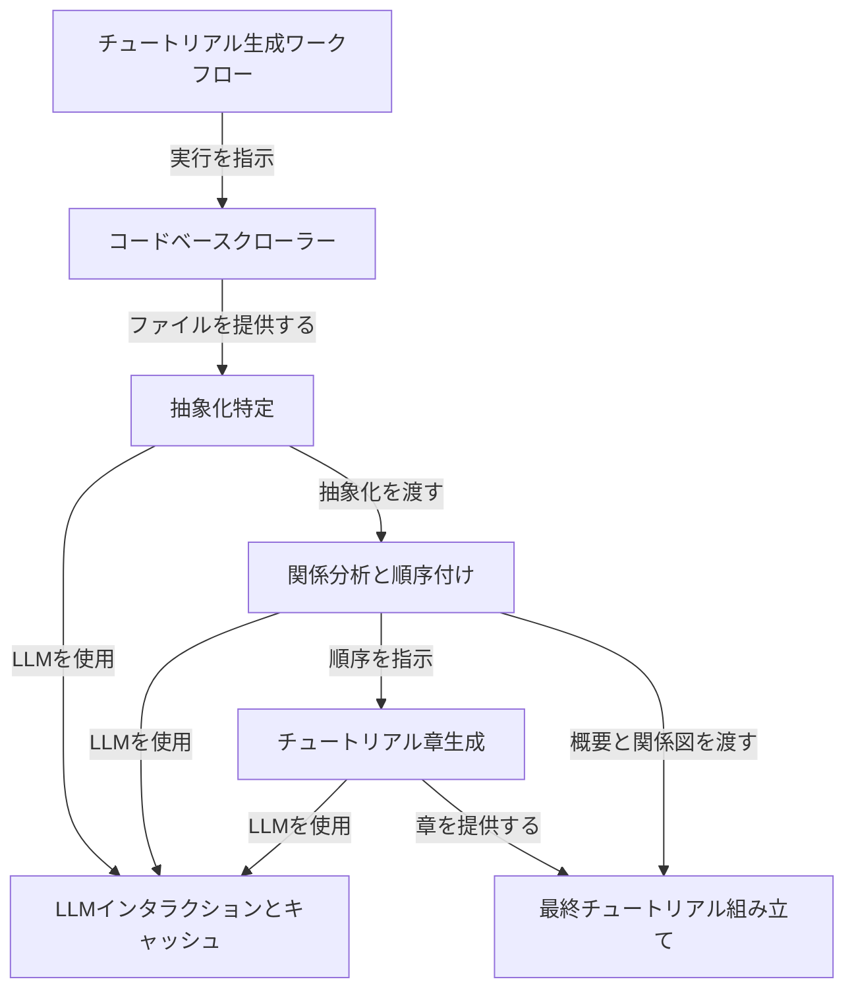

# Tutorial: PocketFlow-Tutorial-Codebase-Knowledge-HITL

「PocketFlow-Tutorial-Codebase-Knowledge-HITL」は、与えられたコードベースから**初心者向けのチュートリアルを自動生成する**プロジェクトです。このシステムは、コードファイルを**クロール**し、大規模言語モデル（LLM）を使用して**コア概念を特定**します。その後、概念間の関係を分析し、最適な章の順序を決定し、各抽象化について**個別のチュートリアル章を執筆**します。最終的に、これらの章、プロジェクトの概要、および関係図を組み合わせて、**完全にナビゲート可能なチュートリアル**を完成させます。

**Source Repository:** [https://github.com/sugeryp/PocketFlow-Tutorial-Codebase-Knowledge-HITL](https://github.com/sugeryp/PocketFlow-Tutorial-Codebase-Knowledge-HITL)

## Chapters

1. [チュートリアル生成ワークフロー
](01_チュートリアル生成ワークフロー_.md)
2. [LLMインタラクションとキャッシュ
](02_llmインタラクションとキャッシュ_.md)
3. [コードベースクローラー
](03_コードベースクローラー_.md)
4. [抽象化特定
](04_抽象化特定_.md)
5. [関係分析と順序付け
](05_関係分析と順序付け_.md)
6. [チュートリアル章生成
](06_チュートリアル章生成_.md)
7. [最終チュートリアル組み立て
](07_最終チュートリアル組み立て_.md)

---

Generated by [AI Codebase Knowledge Builder](https://github.com/The-Pocket/Tutorial-Codebase-Knowledge)